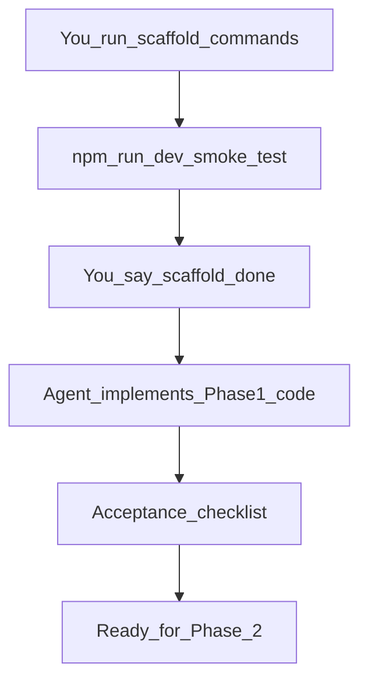

# Phase 1 — Foundation & Tooling (Detailed Plan)

## Goal

A runnable local dev shell: Vite + React + TypeScript + TailwindCSS v4 + React Router, with lazy-loaded placeholder pages, light/dark theme toggle (persisted), path aliases, and Vercel-ready SPA routing. No real design or CV content yet — that is Phase 2–3.

---

## Division of work

| You (manual setup)                    | Agent (after you confirm scaffold is done)        |
| ------------------------------------- | ------------------------------------------------- |
| Run scaffold + install commands below | Restructure folders, configs, and all `src/` code |
| Verify `npm run dev` works            | Wire router, theme, placeholders, `vercel.json`   |
| Optional: init git + first commit     | Fix any conflicts with generated boilerplate      |

**When to hand off:** Reply with something like _"scaffold is done, code the rest"_ after `npm run dev` opens the default Vite page without errors.

---

## Part A — Your setup guide (run these commands)

### Prerequisites

- **Node.js 20+** (`node -v`)
- **npm 10+** (`npm -v`)
- Terminal opened in your portfolio folder:

```powershell
cd "c:\Users\Aron Rez\OneDrive\Documents\Codes\Repositories\Portfolio"
```

### Step 1 — Scaffold Vite + React + TypeScript

Your folder already contains [Arboleda_CV.txt](Arboleda_CV.txt). Vite will warn that the directory is not empty — **choose to continue** (do not delete existing files).

```powershell
npm create vite@latest . -- --template react-ts
```

If the prompt does not appear and it fails, use a subfolder instead:

```powershell
npm create vite@latest portfolio-app -- --template react-ts
```

Then move contents up one level and remove the empty subfolder. Prefer the `.` approach to keep CV at repo root.

### Step 2 — Install base dependencies

```powershell
npm install
```

### Step 3 — Install routing, styling, and utilities

```powershell
npm install react-router-dom clsx tailwind-merge
npm install -D tailwindcss @tailwindcss/vite
```

### Step 4 — Install dev quality-of-life (optional but recommended)

```powershell
npm install -D prettier eslint-config-prettier
```

We will add Prettier/ESLint config files in the agent step; skipping Step 4 is fine if you prefer minimal setup.

### Step 5 — Smoke test

```powershell
npm run dev
```

Open the URL shown (usually `http://localhost:5173`). You should see the default Vite + React page. Stop the server with `Ctrl+C`.

### Step 6 — Optional git init

Only if this repo is not already a git repo:

```powershell
git init
git add .
git commit -m "chore: scaffold Vite React TypeScript project"
```

Add a `.gitignore` is included by Vite by default — do not commit `node_modules/` or `dist/`.

### What you should have after Step 5

```
Portfolio/
├── Arboleda_CV.txt          (unchanged)
├── index.html
├── package.json
├── tsconfig.json
├── tsconfig.app.json
├── tsconfig.node.json
├── vite.config.ts
├── eslint.config.js
├── public/
│   └── vite.svg
└── src/
    ├── main.tsx
    ├── App.tsx
    ├── App.css
    ├── index.css
    └── assets/
```

---

## Part B — Agent implementation (after your handoff)

### B1 — Vite + TypeScript config

**[`vite.config.ts`](vite.config.ts)**

- Add `@tailwindcss/vite` plugin
- Add path alias: `@` → `./src`

```ts
import {defineConfig} from "vite";
import react from "@vitejs/plugin-react";
import tailwindcss from "@tailwindcss/vite";
import path from "path";

export default defineConfig({
  plugins: [react(), tailwindcss()],
  resolve: {
    alias: {"@": path.resolve(__dirname, "./src")},
  },
});
```

**[`tsconfig.app.json`](tsconfig.app.json)** — add:

```json
"compilerOptions": {
  "baseUrl": ".",
  "paths": { "@/*": ["./src/*"] }
}
```

Enable **strict** TypeScript (verify `strict: true`).

---

### B2 — Tailwind + minimal theme CSS

Replace default Vite styles with a theme-ready foundation.

**[`src/styles/globals.css`](src/styles/globals.css)** (new)

- `@import "tailwindcss"`
- CSS custom properties for light and dark themes (minimal set for Phase 1):
  - `--color-surface`, `--color-surface-elevated`
  - `--color-text-primary`, `--color-text-muted`
  - `--color-accent`, `--color-border`
- `html { color-scheme: light dark }`
- `html.dark` overrides for dark theme
- Base body styles using variables
- Smooth `transition` on `background-color` / `color` for theme switch

**[`src/main.tsx`](src/main.tsx)** — import `@/styles/globals.css` instead of `index.css`; remove `App.css` import from `App.tsx`.

Delete boilerplate: `src/App.css`, `src/index.css` (after migration).

---

### B3 — Folder structure

Create empty scaffold (files added in substeps):

```
src/
├── components/
│   ├── layout/
│   │   ├── RootLayout.tsx
│   │   ├── Header.tsx          (minimal: site name + nav links + ThemeToggle)
│   │   ├── Footer.tsx          (minimal placeholder)
│   │   └── ThemeToggle.tsx
│   └── ui/
│       └── PagePlaceholder.tsx (reusable "coming in Phase X" block)
├── hooks/
│   └── useTheme.ts
├── lib/
│   └── cn.ts                   (clsx + tailwind-merge)
├── pages/
│   ├── HomePage.tsx
│   ├── AboutPage.tsx
│   ├── JourneyPage.tsx
│   ├── ProjectsPage.tsx
│   ├── ProjectDetailPage.tsx
│   ├── ExperiencePage.tsx
│   ├── ContactPage.tsx
│   └── NotFoundPage.tsx
├── providers/
│   └── ThemeProvider.tsx
├── routes/
│   └── index.tsx               (route config + lazy imports)
├── types/
│   └── index.ts                (empty exports placeholder)
├── App.tsx
└── main.tsx
```

---

### B4 — Core utilities

**[`src/lib/cn.ts`](src/lib/cn.ts)**

```ts
import {clsx, type ClassValue} from "clsx";
import {twMerge} from "tailwind-merge";

export function cn(...inputs: ClassValue[]) {
  return twMerge(clsx(inputs));
}
```

---

### B5 — Theme system (light / dark / system)

**[`src/providers/ThemeProvider.tsx`](src/providers/ThemeProvider.tsx)**

- React context exposing: `theme` (`'light' | 'dark' | 'system'`), `resolvedTheme`, `setTheme`
- On mount: read `localStorage.getItem('portfolio-theme')`
- Apply `dark` class to `<html>` when resolved theme is dark
- Listen to `prefers-color-scheme` when theme is `system`
- Phase 1 toggle cycles: light → dark → system (or light ↔ dark only — keep simple)

**[`src/hooks/useTheme.ts`](src/hooks/useTheme.ts)** — thin context consumer hook.

**[`src/components/layout/ThemeToggle.tsx`](src/components/layout/ThemeToggle.tsx)** — button with `aria-label`, sun/moon icons (inline SVG or text emoji for Phase 1; Lucide added in Phase 2).

---

### B6 — Routing (React Router v7)

**[`src/routes/index.tsx`](src/routes/index.tsx)**

| Path              | Component           | Lazy |
| ----------------- | ------------------- | ---- |
| `/`               | `HomePage`          | yes  |
| `/about`          | `AboutPage`         | yes  |
| `/journey`        | `JourneyPage`       | yes  |
| `/projects`       | `ProjectsPage`      | yes  |
| `/projects/:slug` | `ProjectDetailPage` | yes  |
| `/experience`     | `ExperiencePage`    | yes  |
| `/contact`        | `ContactPage`       | yes  |
| `*`               | `NotFoundPage`      | yes  |

- `createBrowserRouter` + `RouterProvider`
- `RootLayout` wraps all routes via `<Outlet />`
- `React.Suspense` fallback: simple centered "Loading…" using theme colors
- `ScrollToTop` component: `useEffect` on `pathname` → `window.scrollTo(0, 0)`

**[`src/components/layout/RootLayout.tsx`](src/components/layout/RootLayout.tsx)**

- Skip-to-content link (`href="#main"`)
- `Header` + `<main id="main">` + `Footer`
- Min-height full viewport flex column

**[`src/components/layout/Header.tsx`](src/components/layout/Header.tsx)** — Phase 1 minimal:

- Name: "Aron Arboleda"
- Nav links: Home, About, Journey, Projects, Experience, Contact
- `NavLink` with active state class
- `ThemeToggle` on the right
- No mobile drawer yet (Phase 2) — stacked or horizontal links that wrap on small screens

---

### B7 — Placeholder pages

Each page in [`src/pages/`](src/pages/) uses `PagePlaceholder`:

- Page title (e.g. "Projects")
- One-line: "Content coming in Phase 4"
- `ProjectDetailPage` reads `:slug` from `useParams()` and displays slug name

**[`src/pages/HomePage.tsx`](src/pages/HomePage.tsx)** — slightly richer Phase 1 hero:

- "Aron Rez D. Arboleda"
- "Software Developer"
- Short tagline from CV objective (one sentence)
- Confirms theme + routing work

---

### B8 — App entry refactor

**[`src/App.tsx`](src/App.tsx)** — only:

```tsx
import {RouterProvider} from "react-router-dom";
import {ThemeProvider} from "@/providers/ThemeProvider";
import {router} from "@/routes";

export default function App() {
  return (
    <ThemeProvider>
      <RouterProvider router={router} />
    </ThemeProvider>
  );
}
```

**[`src/main.tsx`](src/main.tsx)** — wrap removed (ThemeProvider in App); strict mode kept.

---

### B9 — Vercel SPA config

**[`vercel.json`](vercel.json)** (repo root)

```json
{
  "rewrites": [{"source": "/(.*)", "destination": "/index.html"}]
}
```

Ensures `/projects/u-heal` etc. work on refresh in production.

---

### B10 — Prettier + ESLint (if Step 4 was run)

**[`.prettierrc`](.prettierrc)** — semi: false, singleQuote: true, trailingComma: 'es5'

**[`eslint.config.js`](eslint.config.js)** — extend with `eslint-config-prettier` to avoid format conflicts

**[`package.json`](package.json)** scripts:

```json
"format": "prettier --write \"src/**/*.{ts,tsx,css}\"",
"lint": "eslint ."
```

---

### B11 — Cleanup default Vite boilerplate

- Remove Vite/React logo imports from pages
- Remove unused `src/assets/react.svg` references
- Keep `public/vite.svg` until custom favicon in Phase 7

---

## File change summary (agent)

| Action | Files                                                                                                                                                                                                                                                  |
| ------ | ------------------------------------------------------------------------------------------------------------------------------------------------------------------------------------------------------------------------------------------------------ |
| Modify | `vite.config.ts`, `tsconfig.app.json`, `src/main.tsx`, `src/App.tsx`, `package.json` (scripts), `eslint.config.js`                                                                                                                                     |
| Create | `src/styles/globals.css`, `src/lib/cn.ts`, `src/providers/ThemeProvider.tsx`, `src/hooks/useTheme.ts`, `src/routes/index.tsx`, all `src/pages/*`, all `src/components/layout/*`, `src/components/ui/PagePlaceholder.tsx`, `vercel.json`, `.prettierrc` |
| Delete | `src/App.css`, `src/index.css` (after globals migration)                                                                                                                                                                                               |

**Not in Phase 1** (deferred): Framer Motion, Lucide icons, real fonts, `src/data/`, mobile nav drawer, polished Header/Footer styling.

---

## Acceptance checklist

After agent completes Phase 1, all of these should pass:

- [ ] `npm run dev` — no console errors
- [ ] `npm run build` — succeeds with zero TS errors
- [ ] `/`, `/about`, `/journey`, `/projects`, `/experience`, `/contact` each render
- [ ] `/projects/test-slug` shows slug in placeholder
- [ ] `/unknown-route` shows 404 page
- [ ] Theme toggle switches light/dark; refresh preserves choice
- [ ] Nav active link highlights current route
- [ ] `@/` imports resolve (no relative `../../` in new files)
- [ ] `vercel.json` present for future deploy

---

## Flow diagram



---

## Handoff message template

When setup is complete, send:

> Scaffold is done. `npm run dev` works. Please code Phase 1.

If anything failed, include the error output.

---

## Next phase preview

**Phase 2** will replace minimal Header/Footer with the full design system: Instrument Serif + DM Sans, semantic Tailwind tokens, mobile drawer, `Button`/`Card`/`Section` components, and grain texture — built on top of this foundation.
