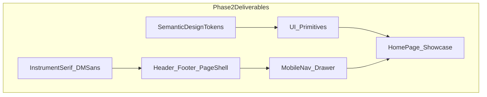

# Phase 2 — Design System & Layout (Detailed Plan)

## Goal

Transform the functional Phase 1 shell into **polished site chrome** that feels hand-crafted and professional. After this phase, every page shares consistent typography, spacing, colors, and layout primitives — ready for Phase 3 content and Phase 4 page builds.

**In scope:** tokens, fonts, UI components, layout refactor, mobile nav, hero grain, a11y polish.  
**Out of scope:** CV data files, project cards, timeline content, Framer Motion scroll animations (Phase 6).

---

## Starting point (Phase 1 complete)

Current state to build on:

- Minimal CSS variables in [`src/styles/globals.css`](src/styles/globals.css) with `var(--color-*)` used via arbitrary Tailwind classes
- Basic [`Header`](src/components/layout/Header.tsx) (wraps nav links, no mobile drawer)
- Minimal [`Footer`](src/components/layout/Footer.tsx), [`ThemeToggle`](src/components/layout/ThemeToggle.tsx) (inline SVGs)
- [`HomePage`](src/pages/HomePage.tsx) with inline-styled `Link` buttons
- No shared `Button`, `Card`, `Section`, or `PageShell`



---

## Step 1 — Dependencies

Install icon library (replaces inline SVGs):

```powershell
npm install lucide-react
```

**Fonts** — self-hosted via Fontsource (no external Google Fonts request at runtime):

```powershell
npm install @fontsource-variable/dm-sans @fontsource/instrument-serif
```

Import in [`src/main.tsx`](src/main.tsx) before `globals.css`.

**Not installing yet:** `framer-motion` (Phase 6), `simple-icons` (Phase 3/5 for tech logos).

---

## Step 2 — Expanded design tokens

Upgrade [`src/styles/globals.css`](src/styles/globals.css) with a full token system and Tailwind v4 `@theme` mapping so components use **semantic utilities** instead of `var(--color-*)` everywhere.

### CSS custom properties (light + `html.dark`)

| Token                | Light                    | Dark                     | Purpose                |
| -------------------- | ------------------------ | ------------------------ | ---------------------- |
| `--surface`          | `#faf9f7`                | `#141210`                | Page background        |
| `--surface-elevated` | `#ffffff`                | `#1e1c19`                | Cards, header, footer  |
| `--surface-muted`    | `#f3f1ed`                | `#1a1816`                | Subtle sections        |
| `--text-primary`     | `#1a1814`                | `#f5f2ed`                | Headings, body         |
| `--text-muted`       | `#6b6560`                | `#a39e97`                | Secondary text         |
| `--text-inverse`     | `#faf9f7`                | `#141210`                | Text on accent buttons |
| `--accent`           | `#c4956a`                | `#d4a574`                | Links, highlights      |
| `--accent-muted`     | `rgba(196,149,106,0.15)` | `rgba(212,165,116,0.15)` | Active nav pill        |
| `--border`           | `#e8e4df`                | `#2e2b27`                | Dividers, card edges   |
| `--border-strong`    | `#d4cfc8`                | `#3d3934`                | Emphasized borders     |
| `--shadow-soft`      | subtle rgba              | deeper rgba              | Card hover elevation   |

### Tailwind `@theme inline` block

Map tokens to utilities usable across components:

- Colors: `bg-surface`, `bg-surface-elevated`, `bg-surface-muted`, `text-primary`, `text-muted`, `text-accent`, `border-border`, `bg-accent`, `bg-accent-muted`
- Fonts: `font-heading` (Instrument Serif), `font-body` (DM Sans)
- Radius: `rounded-card` (12px), `rounded-button` (8px)
- Max width: `max-w-content` (72rem / 1152px — matches master plan)
- Spacing rhythm: section padding utilities via component classes, not magic numbers scattered

### Base typography rules in `globals.css`

```css
h1,
h2,
h3 {
  font-family: var(--font-heading);
  font-weight: 500;
}
body {
  font-family: var(--font-body);
}
```

### Grain texture utility

Add `.grain-overlay` class — pseudo-element with SVG noise at ~4% opacity, `pointer-events: none`. Applied only to hero regions (HomePage), not site-wide.

### Accessibility additions

- `@media (prefers-reduced-motion: reduce)` — disable drawer slide transition, grain is static
- Improved `:focus-visible` using `ring-accent`
- `scroll-margin-top` on `main` children for sticky header offset

---

## Step 3 — Shared config (navigation only)

Create [`src/config/navigation.ts`](src/config/navigation.ts) — single source for nav links (used by Header + MobileNav):

```ts
export const navLinks = [
  {to: "/", label: "Home", end: true},
  {to: "/about", label: "About", end: false},
  // ... journey, projects, experience, contact
] as const;
```

Create [`src/config/site.ts`](src/config/site.ts) with **minimal** static strings for layout chrome only (migrated to `src/data/profile.ts` in Phase 3):

- `siteName`, `fullName`, `role`, `email` (from CV: `arboleda.aronrez@gmail.com`)
- `githubUrl` placeholder (`https://github.com/Aron-Arboleda`)

---

## Step 4 — New hook

**[`src/hooks/useMediaQuery.ts`](src/hooks/useMediaQuery.ts)**

- `useMediaQuery('(min-width: 768px)')` for desktop breakpoint
- SSR-safe default (`false` on first render, sync on mount)
- Used by Header to coordinate desktop nav vs mobile drawer

---

## Step 5 — UI primitives (`src/components/ui/`)

All components: typed props, `cn()` for class merging, forward refs where relevant, semantic tokens only.

### `Button.tsx`

| Prop      | Values                                                                                |
| --------- | ------------------------------------------------------------------------------------- |
| `variant` | `primary` \| `secondary` \| `ghost`                                                   |
| `size`    | `sm` \| `md` \| `lg`                                                                  |
| `asChild` | **No** — keep simple; use `Button` for actions, `ButtonLink` wrapper for router links |

**`ButtonLink.tsx`** — `NavLink`/`Link` styled with same variant classes (used on HomePage, NotFoundPage).

Visual spec:

- **Primary:** `bg-accent text-inverse`, subtle hover darken, focus ring
- **Secondary:** `border border-border`, hover `border-accent text-accent`
- **Ghost:** transparent, hover `bg-surface-muted`

### `Card.tsx`

- `bg-surface-elevated border border-border rounded-card`
- Optional `hover` prop: lift + `shadow-soft` transition
- Subcomponents: `CardHeader`, `CardContent` (optional, keep flat if YAGNI — single Card with `children` is enough for Phase 2)

### `Badge.tsx`

- Small pill: `bg-accent-muted text-accent text-xs font-medium px-2.5 py-0.5 rounded-full`
- Used later for tech tags; demo on HomePage with "Software Developer" / "Open to opportunities"

### `Tag.tsx`

- Outlined variant for skill/category labels: `border border-border text-muted`
- Distinct from Badge (filled vs outlined)

### `Divider.tsx`

- Horizontal rule: `border-t border-border`, optional `label` prop centered with lines

### `Section.tsx`

Wrapper for consistent vertical rhythm:

```tsx
type SectionProps = {
  id?: string;
  eyebrow?: string; // small uppercase accent label
  title?: string;
  subtitle?: string;
  children: ReactNode;
  className?: string;
};
```

- Default: `py-16 md:py-24`
- Renders `SectionHeading` internally when title provided

### `SectionHeading.tsx`

- Eyebrow: `text-accent uppercase tracking-widest text-sm font-medium`
- Title: `font-heading text-3xl md:text-4xl text-primary`
- Subtitle: `text-muted max-w-2xl mt-4`

### `PageShell.tsx`

Page-level container replacing repeated `mx-auto max-w-6xl px-4` patterns:

```tsx
type PageShellProps = {
  children: ReactNode;
  className?: string;
  variant?: "default" | "narrow" | "full"; // narrow = max-w-3xl for text pages
};
```

### `Container.tsx` (optional thin wrapper)

If `PageShell` covers it, skip `Container` to avoid duplication. **Recommendation:** only `PageShell`.

### `HeroGrain.tsx`

- Wrapper `div` with `relative overflow-hidden` + `.grain-overlay` child
- Props: `children`, `className`
- Used on HomePage hero block

### `PageLoading.tsx`

Move from [`RootLayout.tsx`](src/components/layout/RootLayout.tsx) to [`src/components/ui/PageLoading.tsx`](src/components/ui/PageLoading.tsx) — styled spinner or pulsing accent dot using design tokens.

---

## Step 6 — Layout components refactor

### `Header.tsx` — full redesign

Structure:

```
[Logo: AR monogram + "Aron Arboleda"]     [Desktop Nav] [ThemeToggle] [Hamburger md:hidden]
```

- **Logo:** `font-heading` name, small square monogram with accent border
- **Desktop nav** (`hidden md:flex`): `navLinks` from config, active state uses `bg-accent-muted text-accent`
- **Mobile:** hamburger button (`Menu` / `X` from Lucide), opens `MobileNav`
- **Scroll behavior:** optional subtle `border-border-strong` + light shadow after scrolling 8px (small `useScrollPosition` hook or inline `useEffect` — keep minimal)
- Sticky: `sticky top-0 z-50 backdrop-blur-md bg-surface/85`

### `MobileNav.tsx` (new)

- Fixed overlay + slide-in panel from right (or full-screen sheet on very small screens)
- Renders same `navLinks` as vertical list with large tap targets
- Closes on: link click, overlay click, `Escape` key
- `aria-expanded`, `aria-controls`, `role="dialog"`, `aria-modal="true"`
- Body `overflow: hidden` while open
- `prefers-reduced-motion`: instant show/hide instead of transform animation
- Theme toggle duplicated inside drawer footer (mobile UX)

### `Footer.tsx` — full redesign

Three-column on `lg`, stacked on mobile:

| Column   | Content                         |
| -------- | ------------------------------- |
| Brand    | Name, role, one-line tagline    |
| Navigate | Compact link list (same routes) |
| Connect  | Email mailto link, GitHub link  |

Bottom bar: copyright + "Built with React + TailwindCSS"

### `ThemeToggle.tsx`

- Replace inline SVGs with Lucide: `Sun`, `Moon`, `Monitor`
- Use `Button` ghost variant for consistent sizing
- Tooltip via `title` + `aria-label` (cycle: light → dark → system)

### `RootLayout.tsx`

- Import upgraded `PageLoading`
- No structural changes beyond polish

---

## Step 7 — Refactor existing pages to use design system

Demonstrate components without adding Phase 3 data.

### `HomePage.tsx` — showcase page

```
HeroGrain
  └── PageShell
        └── Section (no title)
              eyebrow: "Portfolio"
              h1: fullName (font-heading, large)
              role subtitle
              bio tagline (1 sentence)
              Badge row: "Magna Cum Laude" / "Full-Stack Developer" (static for now)
              ButtonLink primary → /projects
              ButtonLink secondary → /journey
```

Add a second `Section` below hero:

- Title: "What I build"
- 3× `Card` grid (1 col mobile, 3 col `md`): Web / Mobile / Desktop — short static blurbs (no project data)
- Cards use `hover` prop for lift effect

### `PagePlaceholder.tsx`

Refactor to use `PageShell` + `SectionHeading` (title + description).

### `NotFoundPage.tsx`

Refactor to use `PageShell`, `SectionHeading`, `ButtonLink`.

### Other placeholder pages

No changes needed — they already use `PagePlaceholder`.

### `index.html`

Update `<title>` to `Aron Arboleda | Software Developer` (basic; full meta in Phase 7).

---

## Step 8 — File structure after Phase 2

```
src/
├── components/
│   ├── layout/
│   │   ├── Header.tsx          (refactored)
│   │   ├── Footer.tsx          (refactored)
│   │   ├── MobileNav.tsx       (new)
│   │   ├── RootLayout.tsx      (minor)
│   │   ├── ThemeToggle.tsx     (refactored)
│   │   └── ScrollToTop.tsx     (unchanged)
│   └── ui/
│       ├── Badge.tsx           (new)
│       ├── Button.tsx          (new)
│       ├── ButtonLink.tsx      (new)
│       ├── Card.tsx            (new)
│       ├── Divider.tsx         (new)
│       ├── HeroGrain.tsx       (new)
│       ├── PageLoading.tsx     (new)
│       ├── PagePlaceholder.tsx (refactored)
│       ├── PageShell.tsx       (new)
│       ├── Section.tsx         (new)
│       ├── SectionHeading.tsx  (new)
│       └── Tag.tsx             (new)
├── config/
│   ├── navigation.ts           (new)
│   └── site.ts                 (new)
├── hooks/
│   ├── useMediaQuery.ts        (new)
│   └── useTheme.ts             (unchanged)
└── styles/
    └── globals.css             (expanded)
```

---

## Component API quick reference

```tsx
// Page wrapper
<PageShell>
  <Section eyebrow="Portfolio" title="Projects" subtitle="...">
    <Card hover>...</Card>
  </Section>
</PageShell>

// Actions
<Button variant="primary" size="md">Click</Button>
<ButtonLink to="/projects" variant="primary">View Projects</ButtonLink>

// Labels
<Badge>Magna Cum Laude</Badge>
<Tag>TypeScript</Tag>
```

---

## Visual spec summary

| Element           | Spec                                                     |
| ----------------- | -------------------------------------------------------- |
| Headings          | Instrument Serif, weight 500, tight letter-spacing on h1 |
| Body              | DM Sans, 16px base, 1.6 line-height                      |
| Accent            | Warm amber/gold — already established in Phase 1         |
| Corners           | 8px buttons, 12px cards                                  |
| Header height     | ~64px                                                    |
| Section gap       | 64px mobile / 96px desktop vertical padding              |
| Max content width | 72rem (`max-w-content`)                                  |

---

## Acceptance checklist

After implementation, verify:

- [ ] `npm run build` and `npm run lint` pass
- [ ] Instrument Serif renders on headings; DM Sans on body (check DevTools computed font)
- [ ] Semantic classes work: `bg-surface`, `text-primary`, `text-accent`, `border-border` (no raw hex in new components)
- [ ] Theme toggle still cycles light / dark / system with persistence
- [ ] **Mobile (375px):** hamburger visible, desktop nav hidden, drawer opens/closes, links navigate, body scroll locked when open
- [ ] **Desktop (≥768px):** horizontal nav visible, hamburger hidden
- [ ] Home hero shows subtle grain texture (light + dark themes)
- [ ] HomePage uses `ButtonLink`, `Card`, `Section`, `HeroGrain` — not inline styles
- [ ] Footer shows email + GitHub links
- [ ] `prefers-reduced-motion: reduce` disables drawer slide animation
- [ ] Skip-to-content link still works
- [ ] All routes still render with upgraded chrome

---

## Migration note: arbitrary `var()` classes

Phase 1 files use `text-[var(--color-text-primary)]`. During Phase 2, **replace all** with semantic tokens (`text-primary`, etc.) in every touched file. Do not leave a mix of old and new patterns.

---

## What comes next (Phase 3 preview)

Phase 3 adds `src/data/*` and `src/types/*` populated from [Arboleda_CV.txt](Arboleda_CV.txt), then migrates `site.ts` strings into `profile.ts`. The design system from Phase 2 will consume that data in Phase 4.

---

## Implementation order (for execution prompt)

When you say "implement Phase 2", we will follow this sequence:

1. Install deps + font imports
2. Expand `globals.css` tokens + `@theme`
3. Add `config/` + `useMediaQuery`
4. Build UI primitives (Button → Card → Section → PageShell)
5. Build `MobileNav` + refactor Header/Footer/ThemeToggle
6. Refactor HomePage, PagePlaceholder, NotFoundPage, PageLoading
7. Replace all `var(--color-*)` arbitrary classes
8. Run build, lint, manual responsive check
