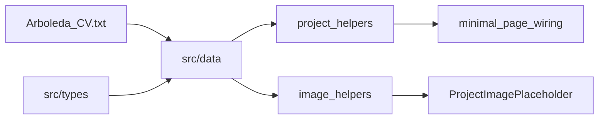

# Phase 3 — Content Layer & Data Models (Detailed Plan)

## Goal

Move **all portfolio content out of pages** and into typed, editable TypeScript data files sourced from [Arboleda_CV.txt](Arboleda_CV.txt). After this phase, adding or editing a project means changing one data file — not hunting through components.

**In scope:** types, data files, project index/helpers, image path utilities, `ProjectImagePlaceholder`, migrate [`src/config/site.ts`](src/config/site.ts) → `src/data/profile.ts`, minimal wiring on existing pages to prove lookups work.

**Out of scope:** Full About/Journey/Projects/Experience page UI (Phase 4), project detail case-study layout (Phase 5), Framer Motion, real image files in `public/`.



---

## Division of work

| Agent implements                                   | You fill in later                                                      |
| -------------------------------------------------- | ---------------------------------------------------------------------- |
| All types + CV seed data                           | Long-form `overview`, `challenges`, `learnings`, `results` per project |
| 11 project files with slugs, tech, features, links | Real screenshots in `public/images/projects/`                          |
| Journey milestones from master plan                | Optional milestone tweaks                                              |
| `profile.ts` with social URLs                      | LinkedIn URL when you have one                                         |

---

## Step 1 — TypeScript interfaces (`src/types/`)

Split types by domain; barrel-export from [`src/types/index.ts`](src/types/index.ts).

### `profile.ts`

```ts
export type SocialLink = {
  label: string;
  href: string;
  type: "email" | "github" | "linkedin" | "other";
};

export type Profile = {
  siteName: string;
  fullName: string;
  role: string;
  email: string;
  phone: string;
  location: string;
  languages: string[];
  objective: string;
  tagline: string; // shortened objective for hero
  socials: SocialLink[];
  highlights: string[]; // e.g. "Magna Cum Laude", "Full-Stack Developer"
};
```

### `education.ts`

```ts
export type EducationLevel = "college" | "senior-high" | "junior-high";

export type Education = {
  id: string;
  level: EducationLevel;
  institution: string;
  location: string;
  degree?: string;
  strand?: string;
  specialization?: string;
  graduated: string; // display: "July 2026"
  honors?: string;
  coursework?: string[];
};
```

### `experience.ts`

```ts
export type ExperienceType = "freelance" | "full-time" | "internship";

export type Experience = {
  id: string;
  title: string;
  type: ExperienceType;
  location: string;
  dateRange: DateRange;
  deliverable: string;
  details: string;
  link?: string;
  projectSlug?: string; // links to /projects/:slug when applicable
};
```

### `certificate.ts`

```ts
export type Certificate = {
  id: string;
  issuer: string;
  title: string;
  date: string; // display: "Nov. 2024"
  description?: string;
};
```

### `organization.ts` + `competition.ts`

```ts
export type Organization = {
  id: string;
  name: string;
  location: string;
  dateRange: DateRange;
  roles: string[];
};

export type Competition = {
  id: string;
  name: string;
  dateRange: DateRange;
  role: string;
  award?: string;
  projectSlug?: string; // raite-hackathon
};
```

### `skills.ts`

```ts
export type SkillGroup = {
  id: string;
  label: string; // "Programming Languages"
  items: string[];
};

export type Skills = SkillGroup[];
```

### `journey.ts`

```ts
export type JourneyMilestone = {
  id: string;
  year: string; // "2020" | "2024–2025"
  title: string;
  body: string;
  kind:
    | "education"
    | "project"
    | "certificate"
    | "organization"
    | "competition"
    | "career";
  projectSlug?: string;
  link?: string;
  sortOrder: number;
};
```

### `project.ts` (most important)

```ts
export type ProjectCategory =
  | "web"
  | "mobile"
  | "desktop"
  | "hardware"
  | "fullstack"
  | "competition";

export type DateRange = {
  start: string; // ISO "2026-01" for sorting
  end?: string; // ISO "2026-04"
  display: string; // "Jan. 2026 – Apr. 2026"
};

export type ProjectLinks = {
  live?: string;
  repo?: string;
  mobile?: string;
};

export type Project = {
  slug: string;
  title: string;
  tagline: string;
  description: string;
  categories: ProjectCategory[];
  techStack: string[];
  features: string[];
  role: string;
  dateRange: DateRange;
  featured: boolean;
  links: ProjectLinks;
  images: {
    hero: string;
    gallery: string[];
  };
  overview: string;
  contribution: string;
  challenges: string[];
  learnings: string[];
  results?: string;
  sortOrder: number;
};
```

**Design decisions:**

- `categories` is an array so U-HEAL can be `['mobile', 'web']` and appear under both filters in Phase 4.
- `challenges` / `learnings` seeded with a single placeholder string each: _"Add your reflections here."_ — easy for you to find and replace.
- `overview` initially equals `description`; you expand in Phase 5.
- `sortOrder` controls listing and prev/next navigation (newest = lowest number).

---

## Step 2 — Shared date helper

**[`src/lib/dates.ts`](src/lib/dates.ts)**

```ts
export function dateRange(
  start: string,
  end: string | undefined,
  display: string,
): DateRange;
```

Keeps ISO sort keys consistent across experience, projects, and journey.

---

## Step 3 — Data files (`src/data/`)

### [`src/data/profile.ts`](src/data/profile.ts)

Populate from CV personal info + objective:

| Field        | CV source                                                |
| ------------ | -------------------------------------------------------- |
| `fullName`   | Aron Rez D. Arboleda                                     |
| `email`      | arboleda.aronrez@gmail.com                               |
| `phone`      | +63 929-467-4510                                         |
| `location`   | 0295 Cutcut 1st, Capas, Tarlac, Philippines              |
| `languages`  | Filipino, English, Kapampangan                           |
| `objective`  | Full objective statement                                 |
| `tagline`    | First 1–2 sentences of objective                         |
| `highlights` | `['Magna Cum Laude', 'Full-Stack Developer']`            |
| `socials`    | email mailto + GitHub `https://github.com/Aron-Arboleda` |

### [`src/data/education.ts`](src/data/education.ts)

3 entries: College (TSU, Magna Cum Laude), SHS STEM, JHS Computer System Servicing — with coursework on college entry.

### [`src/data/experience.ts`](src/data/experience.ts)

3 freelance gigs from CV, with `projectSlug` where applicable:

| ID                 | Deliverable       | Slug             |
| ------------------ | ----------------- | ---------------- |
| liquefact-gig      | Liquefact Web App | `liquefact`      |
| draft2dimen-v2-gig | Draft2Dimen v2    | `draft2dimen-v2` |
| draft2dimen-gig    | Draft2Dimen       | `draft2dimen`    |

### [`src/data/certificates.ts`](src/data/certificates.ts)

5 certificates from CV (RAITE, 2× Cisco, 2× Sololearn).

### [`src/data/organizations.ts`](src/data/organizations.ts)

2 orgs: Liwanag at Dunong, Programmers' Den.

### [`src/data/competitions.ts`](src/data/competitions.ts)

1 entry: RAITE Hackathon → `projectSlug: 'raite-hackathon'`.

### [`src/data/skills.ts`](src/data/skills.ts)

4 groups matching CV sections: Programming Languages, Databases, Frameworks/Libraries, Tools.

### [`src/data/journey.ts`](src/data/journey.ts)

10 milestones from master plan (chronological `sortOrder` 1–10), with `projectSlug` links where relevant:

| sortOrder | Year      | Title (summary)               | projectSlug          |
| --------- | --------- | ----------------------------- | -------------------- |
| 1         | 2020      | JHS Computer System Servicing | —                    |
| 2         | 2022      | SHS STEM                      | —                    |
| 3         | 2022      | Sololearn Python              | —                    |
| 4         | 2023      | First apps + Sololearn JS     | `reminders-builder`  |
| 5         | 2023      | Programmers' Den              | —                    |
| 6         | 2024      | SPELL, Cisco, RAITE           | `spell`              |
| 7         | 2024–2025 | NGO, Rebyu, Draft2Dimen v1    | `liwanag-at-dunong`  |
| 8         | 2025      | Arduino + client work         | `gas-smoke-detector` |
| 9         | 2026      | Thesis + freelance            | `u-heal`             |
| 10        | 2026      | BS CS Magna Cum Laude         | —                    |

---

## Step 4 — Project files (`src/data/projects/`)

One file per project; each exports `const project: Project`.

### All 11 projects (slug → featured flag)

| slug                 | title                              | featured | categories  | sortOrder |
| -------------------- | ---------------------------------- | -------- | ----------- | --------- |
| `u-heal`             | U-HEAL                             | yes      | mobile, web | 1         |
| `liquefact`          | LIQUEFACT                          | yes      | web         | 2         |
| `draft2dimen-v2`     | Draft2Dimen v2                     | no       | desktop     | 3         |
| `gas-smoke-detector` | Arduino Gas & Smoke Warning System | no       | hardware    | 4         |
| `draft2dimen`        | Draft2Dimen                        | no       | desktop     | 5         |
| `liwanag-at-dunong`  | Liwanag at Dunong Website          | yes      | fullstack   | 6         |
| `rebyu`              | Rebyu: Gamified Flashcards         | no       | fullstack   | 7         |
| `spell`              | SPELL                              | no       | desktop     | 8         |
| `nom-vet`            | Nom Veterinary Clinic              | no       | desktop     | 9         |
| `reminders-builder`  | Reminders Builder                  | no       | desktop     | 10        |
| `raite-hackathon`    | RAITE Hackathon                    | no       | competition | 11        |

### Per-file seed content (from CV)

Each file includes:

- `techStack` parsed from CV Tech line
- `features` array (U-HEAL gets 7 feature bullets; others get key points from Details)
- `links.live` / `links.repo` / `links.mobile` from CV
- `role` from CV Role line
- `images.hero` + `images.gallery` using image helper paths (filenames from master plan asset table)
- `contribution` = CV Role + Details combined
- Placeholder `challenges` / `learnings`

**RAITE hackathon** (`raite-hackathon.ts`): synthesized from Competitions + Certificate entries — no standalone CV Projects block, but included as 11th showcase per master plan.

### [`src/data/projects/index.ts`](src/data/projects/index.ts) — project registry + helpers

```ts
import {uHeal} from "./u-heal";
// ... all 11 imports

export const projects: Project[] = [uHeal, liquefact /* ... */];

export const projectCategories = [
  {id: "all", label: "All"},
  {id: "web", label: "Web"},
  {id: "mobile", label: "Mobile"},
  {id: "desktop", label: "Desktop"},
  {id: "hardware", label: "Hardware"},
  {id: "fullstack", label: "Full-stack"},
  {id: "competition", label: "Competition"},
] as const;

export type ProjectFilterId = (typeof projectCategories)[number]["id"];

export function getAllProjects(): Project[];
export function getProjectBySlug(slug: string): Project | undefined;
export function getFeaturedProjects(): Project[];
export function filterProjects(category: ProjectFilterId): Project[];
export function getAdjacentProjects(slug: string): {
  prev?: Project;
  next?: Project;
};
export function getAllProjectSlugs(): string[];
```

**`filterProjects` logic:** `'all'` returns everything sorted by `sortOrder`; other ids return projects where `categories.includes(category)`.

**`getAdjacentProjects`:** sort by `sortOrder` ascending; prev = higher sortOrder number (older), next = lower (newer).

### [`src/data/index.ts`](src/data/index.ts)

Barrel re-export of all data + project helpers for clean imports:

```ts
export { profile } from './profile'
export { projects, getProjectBySlug, ... } from './projects'
```

---

## Step 5 — Image utilities

**[`src/lib/images.ts`](src/lib/images.ts)**

```ts
const PROJECT_IMAGES_BASE = "/images/projects";
const PROFILE_IMAGES_BASE = "/images/profile";

export function projectImagePath(slug: string, filename: string): string;
export function projectHeroPath(slug: string): string; // → hero.webp
export function projectGalleryPaths(
  slug: string,
  filenames: string[],
): string[];
export function profileImagePath(filename = "aron-portrait.webp"): string;
export function buildProjectImages(slug: string, galleryFilenames: string[]);
```

`buildProjectImages` returns `{ hero, gallery }` object used in each project file — avoids repeating path logic 11 times.

**Gallery filenames per project** (from master plan):

| slug               | gallery files                              |
| ------------------ | ------------------------------------------ |
| u-heal             | mobile-1, mobile-2, dashboard, ai-analysis |
| liquefact          | map, prediction, ui-detail                 |
| draft2dimen-v2     | calculator, cost-report, local-save        |
| draft2dimen        | pdf-export, component-calc                 |
| gas-smoke-detector | device, wiring, demo                       |
| liwanag-at-dunong  | landing, volunteer-form, admin-dashboard   |
| rebyu              | gameplay, flashcards, pixel-ui             |
| spell              | editor, grammar-check                      |
| nom-vet            | dashboard, records                         |
| reminders-builder  | reminder-list, create-reminder             |
| raite-hackathon    | team, demo                                 |

---

## Step 6 — `ProjectImagePlaceholder` component

**[`src/components/projects/ProjectImagePlaceholder.tsx`](src/components/projects/ProjectImagePlaceholder.tsx)**

Props: `title: string`, `slug?: string`, `aspectRatio?: 'video' | 'square'`, `className?`

Visual spec:

- `rounded-card border border-border bg-surface-muted`
- Subtle diagonal gradient using accent at low opacity
- Centered project title in `font-heading`
- Optional slug subtitle in `text-muted text-xs`

**[`src/components/projects/ProjectImage.tsx`](src/components/projects/ProjectImage.tsx)** (companion)

```tsx
// Tries ; on error → ProjectImagePlaceholder
// alt required for a11y
```

Used in Phase 5 gallery; built now so image paths are testable.

---

## Step 7 — Migrate `site.ts` → `profile.ts`

1. Create full [`src/data/profile.ts`](src/data/profile.ts)
2. Update imports in:
   - [`src/components/layout/Header.tsx`](src/components/layout/Header.tsx) — `profile.siteName`
   - [`src/components/layout/Footer.tsx`](src/components/layout/Footer.tsx) — `profile.fullName`, `profile.role`, `profile.email`, `profile.socials`
   - [`src/pages/HomePage.tsx`](src/pages/HomePage.tsx) — `profile.fullName`, `profile.role`, `profile.tagline`, `profile.highlights`
3. Delete [`src/config/site.ts`](src/config/site.ts) or make it a thin re-export:

```ts
// Deprecated — use @/data/profile
export {profile as site} from "@/data/profile";
```

**Recommendation:** delete `site.ts` and update all imports to `@/data/profile` to avoid two sources of truth.

---

## Step 8 — Minimal page wiring (validation only)

Phase 3 does **not** build full pages, but wires enough to verify data:

### [`src/pages/ProjectDetailPage.tsx`](src/pages/ProjectDetailPage.tsx)

```tsx
const project = getProjectBySlug(slug ?? '')
if (!project) return <NotFound-style message or navigate>
return (
  <PageShell>
    <Section>
      <SectionHeading title={project.title} subtitle={project.tagline} />
      <div className="flex flex-wrap gap-2">{project.techStack.map(...Tag)}</div>
      <ProjectImage src={project.images.hero} alt={project.title} />
      <p className="text-muted">{project.description}</p>
      <p className="text-sm text-muted italic">Full case study coming in Phase 5.</p>
    </Section>
  </PageShell>
)
```

### [`src/pages/HomePage.tsx`](src/pages/HomePage.tsx)

- Replace hardcoded `Badge` strings with `profile.highlights.map`
- Keep static `buildAreas` cards for now (not CV data — Phase 4 may derive from skills)

### Optional: [`src/pages/ProjectsPage.tsx`](src/pages/ProjectsPage.tsx)

Temporary dev listing — simple unordered list of `getAllProjects()` titles linking to slugs. **Or** keep placeholder text. **Recommendation:** add minimal list so you can click through all 11 projects during acceptance testing.

---

## Step 9 — Runtime validation (lightweight)

**[`src/data/projects/validate.ts`](src/data/projects/validate.ts)** (dev-only assert)

Called once from [`src/main.tsx`](src/main.tsx) in development:

- All slugs unique
- All 11 expected slugs present
- Every `images.hero` path starts with `/images/projects/`
- `featured` count === 3

Throws console error in dev if validation fails; no-op in production.

---

## File structure after Phase 3

```
src/
├── types/
│   ├── project.ts
│   ├── profile.ts
│   ├── education.ts
│   ├── experience.ts
│   ├── certificate.ts
│   ├── journey.ts
│   ├── organization.ts
│   ├── competition.ts
│   ├── skills.ts
│   └── index.ts
├── data/
│   ├── profile.ts
│   ├── education.ts
│   ├── experience.ts
│   ├── certificates.ts
│   ├── organizations.ts
│   ├── competitions.ts
│   ├── skills.ts
│   ├── journey.ts
│   ├── projects/
│   │   ├── u-heal.ts
│   │   ├── liquefact.ts
│   │   ├── draft2dimen-v2.ts
│   │   ├── gas-smoke-detector.ts
│   │   ├── draft2dimen.ts
│   │   ├── liwanag-at-dunong.ts
│   │   ├── rebyu.ts
│   │   ├── spell.ts
│   │   ├── nom-vet.ts
│   │   ├── reminders-builder.ts
│   │   ├── raite-hackathon.ts
│   │   ├── validate.ts
│   │   └── index.ts
│   └── index.ts
├── lib/
│   ├── images.ts
│   └── dates.ts
└── components/projects/
    ├── ProjectImagePlaceholder.tsx
    └── ProjectImage.tsx
```

**~30 new files**, 3–4 modified pages, 1 deleted config file.

---

## Acceptance checklist

- [ ] `npm run build` and `npm run lint` pass
- [ ] `getProjectBySlug('u-heal')` returns full U-HEAL data with 7 features
- [ ] `getProjectBySlug('invalid')` returns `undefined`
- [ ] `filterProjects('mobile')` includes U-HEAL only
- [ ] `filterProjects('desktop')` includes Draft2Dimen, Draft2Dimen v2, SPELL, Nom Vet, Reminders Builder
- [ ] `getFeaturedProjects()` returns exactly 3: U-HEAL, LIQUEFACT, Liwanag at Dunong
- [ ] `/projects/u-heal` shows real title, tagline, tech tags, image placeholder (not formatted slug)
- [ ] `/projects/bad-slug` shows not-found treatment
- [ ] Header/Footer/HomePage read from `profile` — `site.ts` removed
- [ ] All 11 slugs navigable from temporary Projects list (if added)
- [ ] Dev validation logs no errors on startup
- [ ] No CV text remains hardcoded in layout components

---

## Implementation order (for execution prompt)

1. Types (`src/types/*`)
2. Lib helpers (`dates.ts`, `images.ts`)
3. Non-project data files (profile → skills → journey)
4. 11 project files + `projects/index.ts` + `validate.ts`
5. `data/index.ts` barrel
6. `ProjectImagePlaceholder` + `ProjectImage`
7. Migrate imports; delete `site.ts`
8. Wire `ProjectDetailPage`, `HomePage`, optional `ProjectsPage` list
9. Dev validation in `main.tsx`
10. Build, lint, manual slug walkthrough

---

## Next phase preview

**Phase 4** consumes this data layer to build full pages: About (education + certs), Journey (timeline UI), Experience (freelance cards), Projects (filterable grid with `ProjectCard`), Contact, and an enriched Home (featured projects + skills grid). No new data files needed — only components and page layouts.
