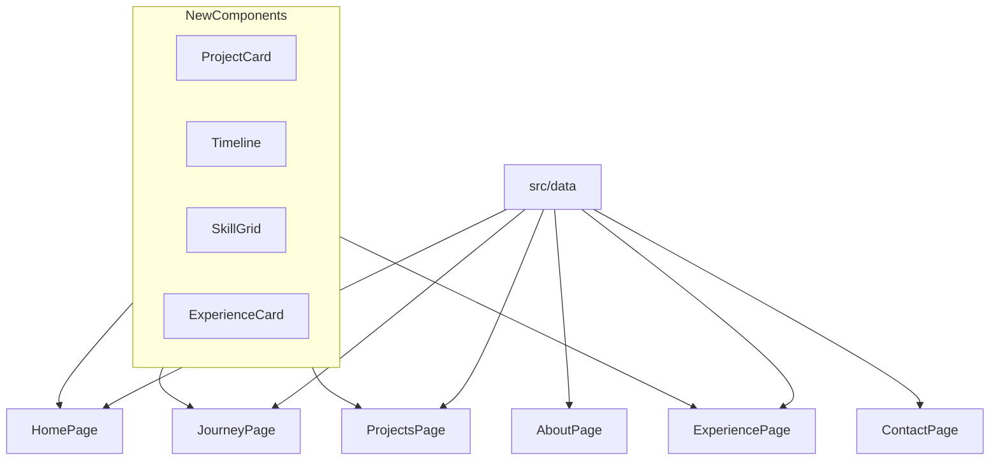

# Phase 4 — Core Pages (Detailed Plan)

## Goal

Replace placeholder pages with **fully designed, data-driven views** across Home, About, Journey, Projects, Experience, and Contact. Every section reads from [`src/data/`](src/data/) — no new CV content, only presentation.

**In scope:** 6 page builds, ~15 new components, `framer-motion` for Journey timeline.  
**Out of scope:** Project detail case-study layout (Phase 5), site-wide scroll animations (Phase 6), real photos (Phase 7), form backend.



---

## Starting point

| Page                                                       | Current state                                                      |
| ---------------------------------------------------------- | ------------------------------------------------------------------ |
| [`HomePage.tsx`](src/pages/HomePage.tsx)                   | Hero + static "What I build" cards; no featured projects or skills |
| [`AboutPage.tsx`](src/pages/AboutPage.tsx)                 | `PagePlaceholder`                                                  |
| [`JourneyPage.tsx`](src/pages/JourneyPage.tsx)             | `PagePlaceholder`                                                  |
| [`ProjectsPage.tsx`](src/pages/ProjectsPage.tsx)           | Temporary vertical list                                            |
| [`ExperiencePage.tsx`](src/pages/ExperiencePage.tsx)       | `PagePlaceholder`                                                  |
| [`ContactPage.tsx`](src/pages/ContactPage.tsx)             | `PagePlaceholder`                                                  |
| [`ProjectDetailPage.tsx`](src/pages/ProjectDetailPage.tsx) | Phase 3 preview — **unchanged** in Phase 4                         |

Data helpers already available: `getFeaturedProjects()`, `filterProjects()`, `projectCategories`, `profile`, `education`, `skills`, `journey`, `experience`, etc.

---

## Step 1 — Dependency

```powershell
npm install framer-motion
```

Used **only** on Journey timeline in Phase 4. Phase 6 may extend motion elsewhere.

---

## Step 2 — New shared components

### Projects (`src/components/projects/`)

#### `TechStack.tsx`

- Props: `items: string[]`, `max?: number` (default 4)
- Renders [`Tag`](src/components/ui/Tag.tsx) per tech; if over max, show `+N` muted tag
- Used inside `ProjectCard` and optionally Home featured section

#### `ProjectCard.tsx`

- Props: `project: Project`
- Layout:
  - [`ProjectImage`](src/components/projects/ProjectImage.tsx) hero (aspect-video, hover subtle scale optional via CSS)
  - Title (`font-heading`), date range, 2-line clamped tagline
  - `TechStack` (max 3)
  - Featured `Badge` when `project.featured`
  - Entire card wrapped in `Link` to `/projects/:slug`
- Styling: [`Card`](src/components/ui/Card.tsx) with `hover` prop, `group` for title color transition

#### `ProjectFilter.tsx`

- Props: `active: ProjectFilterId`, `onChange: (id: ProjectFilterId) => void`
- Renders horizontal chip row from `projectCategories` in [`src/data/projects/index.ts`](src/data/projects/index.ts)
- Active chip: `bg-accent-muted text-accent`; inactive: `border border-border text-muted`
- Mobile: `overflow-x-auto` with `flex-nowrap` and hidden scrollbar
- Accessible: `role="tablist"`, chips as `role="tab"`, `aria-selected`

#### `ProjectGrid.tsx`

- Props: `projects: Project[]`
- Responsive grid: `grid gap-6 sm:grid-cols-2 lg:grid-cols-3`
- Maps to `ProjectCard`; empty state: "No projects in this category."

### Journey (`src/components/journey/`)

#### `MilestoneCard.tsx`

- Props: `milestone: JourneyMilestone`
- Shows `year` (accent, monospace or small caps), `title`, `body`
- If `projectSlug`: `ButtonLink` or text link → `/projects/:slug`
- Kind indicator: subtle icon or label (education / project / certificate) — optional small `Badge`

#### `TimelineNode.tsx`

- Visual dot on the timeline spine + connector line segment
- Props: `isLast?: boolean`

#### `Timeline.tsx`

- Props: `milestones: JourneyMilestone[]` (pre-sorted by `sortOrder`)
- Vertical layout: left border/spine (`border-l-2 border-border`), nodes offset with `pl-8`
- Each milestone wrapped in `motion.div` with:

```tsx
initial={{ opacity: 0, y: 24 }}
whileInView={{ opacity: 1, y: 0 }}
viewport={{ once: true, margin: '-50px' }}
transition={{ duration: 0.4, delay: index * 0.08 }}
```

- Respect `prefers-reduced-motion`: skip animation (check `window.matchMedia` or Framer Motion `useReducedMotion()`)

**Large screens (`lg`):** widen spacing; optional sticky year label in left margin — keep simple vertical spine (master plan mentions sidebar timeline at `lg`; implement as wider left column with year prominently displayed beside each node).

### About (`src/components/about/`)

#### `ProfileAvatar.tsx`

- Uses `profileImagePath()` from [`src/lib/images.ts`](src/lib/images.ts)
- Square image with `onError` fallback: "AR" monogram in accent-bordered circle (same style as Header logo)
- Size prop: `lg` (160px) for About hero

#### `EducationCard.tsx`

- Props: `education: Education`
- Card with institution, degree/strand/specialization, graduated, honors badge, coursework as `Tag` list (college only)

#### `CertificateList.tsx`

- Props: `certificates: Certificate[]`
- Vertical list or compact cards: issuer, title, date, description

#### `OrganizationCard.tsx`

- Props: `organization: Organization`
- Name, location, date range, roles as bullet list

### Experience (`src/components/experience/`)

#### `ExperienceCard.tsx`

- Props: `experience: Experience`
- Title, type badge ("Freelance"), date range, location, deliverable, details
- Actions: link to live URL if `link`; `ButtonLink` to `/projects/:slug` if `projectSlug`

### Skills (`src/components/skills/`)

#### `SkillGrid.tsx`

- Props: `skills: Skills`
- Grid: `grid gap-6 sm:grid-cols-2 lg:grid-cols-4` (4 groups from CV)
- Each group: label (`text-accent uppercase text-sm`), items as `Tag` wrap

### Contact (`src/components/contact/`)

#### `ContactInfo.tsx`

- Email (mailto), phone (`tel:`), location, languages, social links from `profile`

#### `ContactForm.tsx`

- Visual form: name, email, message fields (controlled state)
- Submit → `window.location.href = mailto:...` with encoded subject/body (no backend)
- `Button` submit; note below: "Opens your email client"
- `aria-label` and proper `<label>` associations

---

## Step 3 — Page implementations

### [`HomePage.tsx`](src/pages/HomePage.tsx) — enrich existing hero

Keep current hero (`HeroGrain` + profile data). Add three new sections below "What I build":

**Section A — Featured Projects**

- `getFeaturedProjects()` → 3-column grid of `ProjectCard` on `md+`, stack on mobile
- Section title: "Featured work"
- `ButtonLink` → `/projects`

**Section B — Skills snapshot**

- `SkillGrid` with `skills` data
- Section title: "Tech stack"

**Section C — Journey CTA**

- [`Card`](src/components/ui/Card.tsx) with short copy: "From computer servicing in high school to building ML-powered apps — see the full path."
- `ButtonLink` → `/journey` variant primary

Remove or keep "What I build" — **keep** as platform overview (complements skills section; not redundant).

### [`AboutPage.tsx`](src/pages/AboutPage.tsx)

```
PageShell
├── Section: About me
│     ProfileAvatar + objective (profile.objective full text)
│     highlights Badges, languages line
├── Section: Education
│     EducationCard × 3 (college first)
├── Section: Certificates
│     CertificateList
├── Section: Organizations
│     OrganizationCard × 2 (grid md:2-col)
```

### [`JourneyPage.tsx`](src/pages/JourneyPage.tsx)

```
PageShell
├── SectionHeading: "My Journey" + subtitle
└── Timeline milestones={journey sorted by sortOrder}
```

Import `journey` from `@/data/journey`. Sort in page or export pre-sorted from data.

### [`ProjectsPage.tsx`](src/pages/ProjectsPage.tsx) — replace list

State management with URL sync (shareable filters):

```tsx
const [searchParams, setSearchParams] = useSearchParams();
const active = (searchParams.get("category") as ProjectFilterId) ?? "all";
const filtered = filterProjects(active);
```

- `ProjectFilter` updates `?category=web` etc.
- `ProjectGrid` below filter
- Remove "coming in Phase 4" subtitle

### [`ExperiencePage.tsx`](src/pages/ExperiencePage.tsx)

```
PageShell
├── SectionHeading: Experience
└── Stack of ExperienceCard (experience from data, newest first — already ordered in data file)
```

### [`ContactPage.tsx`](src/pages/ContactPage.tsx)

```
PageShell
├── SectionHeading: Get in touch
└── Two-column layout (lg):
      Left: ContactInfo
      Right: ContactForm in Card
```

---

## Step 4 — Optional small data tweak

No new data files required. One optional enhancement in [`src/data/journey.ts`](src/data/journey.ts):

- Export `export const journeySorted = [...journey].sort((a, b) => a.sortOrder - b.sortOrder)` from data or sort in component — prefer sorting in `Timeline` component internally to keep data file pure.

---

## Step 5 — File structure after Phase 4

```
src/components/
├── about/
│   ├── ProfileAvatar.tsx
│   ├── EducationCard.tsx
│   ├── CertificateList.tsx
│   └── OrganizationCard.tsx
├── contact/
│   ├── ContactInfo.tsx
│   └── ContactForm.tsx
├── experience/
│   └── ExperienceCard.tsx
├── journey/
│   ├── Timeline.tsx
│   ├── TimelineNode.tsx
│   └── MilestoneCard.tsx
├── projects/
│   ├── ProjectCard.tsx      (new)
│   ├── ProjectFilter.tsx    (new)
│   ├── ProjectGrid.tsx      (new)
│   ├── TechStack.tsx        (new)
│   ├── ProjectImage.tsx     (existing)
│   └── ProjectImagePlaceholder.tsx
└── skills/
    └── SkillGrid.tsx
```

**Modified pages:** `HomePage`, `AboutPage`, `JourneyPage`, `ProjectsPage`, `ExperiencePage`, `ContactPage`  
**Unchanged:** `ProjectDetailPage`, layout, routing, data files

---

## Visual & responsive spec

| Page / component | Mobile            | Tablet (`md`)          | Desktop (`lg`)                           |
| ---------------- | ----------------- | ---------------------- | ---------------------------------------- |
| ProjectGrid      | 1 col             | 2 col                  | 3 col                                    |
| ProjectFilter    | horizontal scroll | wrapped chips          | wrapped chips                            |
| SkillGrid        | 1 col             | 2 col                  | 4 col                                    |
| About education  | stack             | 2-col grid for JHS/SHS | college full width, SHS/JHS side by side |
| Contact          | stack             | stack                  | 2-col (info + form)                      |
| Journey timeline | vertical spine    | same                   | wider padding, larger year labels        |

---

## Accessibility checklist (built into components)

- Project filter chips keyboard-focusable
- Timeline content readable without animation (reduced motion)
- Contact form labels linked to inputs
- All images have `alt` text
- External links: `rel="noopener noreferrer"`

---

## Acceptance checklist

After implementation:

- [ ] `npm run build` and `npm run lint` pass
- [ ] **Home:** shows 3 featured project cards (U-HEAL, LIQUEFACT, Liwanag at Dunong), skills grid, journey CTA
- [ ] **About:** full objective, 3 education cards, 5 certificates, 2 organizations, avatar with fallback
- [ ] **Journey:** 10 milestones in order, project links work (e.g. U-HEAL node → `/projects/u-heal`), fade-in on scroll
- [ ] **Projects:** filter chips work; `?category=mobile` shows U-HEAL only; `?category=desktop` shows 5 projects; grid layout on `md+`
- [ ] **Experience:** 3 freelance cards with project/deep links where applicable
- [ ] **Contact:** mailto form opens email client; contact info displays email, phone, location
- [ ] No page uses `PagePlaceholder` except pages not in scope
- [ ] `ProjectDetailPage` still works unchanged
- [ ] All content sourced from `@/data/*` — no duplicated CV strings in page files

---

## Implementation order (for execution prompt)

1. `npm install framer-motion`
2. Build leaf components: `TechStack` → `ProjectCard` → `ProjectFilter` → `ProjectGrid`
3. Build `MilestoneCard` → `TimelineNode` → `Timeline`
4. Build About/Experience/Skills/Contact components
5. Implement `ProjectsPage` (filter + grid)
6. Implement `ExperiencePage`, `AboutPage`, `ContactPage`
7. Implement `JourneyPage`
8. Enrich `HomePage`
9. Build, lint, manual responsive pass (375px / 768px / 1280px)

---

## Next phase preview

**Phase 5** refactors [`ProjectDetailPage.tsx`](src/pages/ProjectDetailPage.tsx) into a full `ProjectDetailLayout`: overview, contribution, gallery, challenges/learnings placeholders, prev/next navigation — reusing `ProjectCard`, `TechStack`, and `ProjectImage` from this phase.
