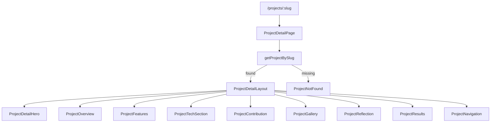

# Phase 5 — Project Detail Pages (Detailed Plan)

## Goal

Replace the Phase 3/4 **preview** [`ProjectDetailPage.tsx`](src/pages/ProjectDetailPage.tsx) with a complete, reusable case-study layout. All 11 projects automatically get the full template via shared data — no per-project page files.

**In scope:** `ProjectDetailLayout` + section components, gallery lightbox, prev/next nav, placeholder styling for user-editable sections.  
**Out of scope:** New CV copy (you edit data files), real screenshots (Phase 7), site-wide animations (Phase 6), `simple-icons` tech logos (optional defer to Phase 6/7).



---

## Starting point

[`Project`](src/types/project.ts) already has all fields needed:

| Field                                                          | Phase 5 usage                                     |
| -------------------------------------------------------------- | ------------------------------------------------- |
| `title`, `tagline`, `role`, `dateRange`, `links`, `categories` | Hero                                              |
| `overview`                                                     | Overview section (currently equals `description`) |
| `features`                                                     | Key features list                                 |
| `techStack`                                                    | Tech section (tags + placeholder notes)           |
| `contribution`                                                 | My contribution                                   |
| `images.hero` + `images.gallery`                               | Hero image + gallery grid                         |
| `challenges`, `learnings`                                      | Reflection blocks (placeholder detection)         |
| `results?`                                                     | Results section (only if defined, e.g. RAITE)     |

[`getAdjacentProjects(slug)`](src/data/projects/index.ts) already exists for prev/next.

Current page renders ~40% of template; remove "Full case study coming in Phase 5" message.

---

## Step 1 — Optional type extension (minimal)

Add to [`src/types/project.ts`](src/types/project.ts):

```ts
export type TechStackItem = {
  name: string
  note?: string
}

// Add optional field to Project:
techStackDetails?: TechStackItem[]
```

**Migration:** none required for Phase 5. If `techStackDetails` is absent, `ProjectTechSection` maps `techStack` strings to items with a default note: _"Add a note about why you chose this technology."_

Optionally seed `techStackDetails` for 1–2 flagship projects (U-HEAL, LIQUEFACT) as examples; leave others auto-generated.

---

## Step 2 — Shared utilities

### [`src/lib/projects.ts`](src/lib/projects.ts) (new)

```ts
export const REFLECTION_PLACEHOLDER = "Add your reflections here.";

export function isReflectionPlaceholder(items: string[]): boolean;
export function imagePathToCaption(path: string): string; // "mobile-1.webp" → "Mobile 1"
export function getTechStackItems(project: Project): TechStackItem[];
```

`imagePathToCaption`: strip path/slug, remove extension, replace hyphens with spaces, title-case.

---

## Step 3 — Section components (`src/components/projects/detail/`)

### `ProjectDetailHero.tsx`

Props: `project: Project`

Layout:

- Eyebrow: category badges (`Badge` per `project.categories` — map to labels: web → Web, etc.)
- `SectionHeading` with `title={project.title}`, `subtitle={project.tagline}`, `titleAs="h1"`
- Meta row: `role` + `dateRange.display` (muted text)
- Action buttons row:
  - Live Demo (`links.live`) — primary external link
  - Repository (`links.repo`) — secondary
  - Mobile build (`links.mobile`) — text link or muted badge if not a URL (U-HEAL Expo string)
- Full-width `ProjectImage` hero below actions

Reuse button styles from [`ExperienceCard`](src/components/experience/ExperienceCard.tsx) external links.

### `ProjectOverview.tsx`

Props: `overview: string`

- `Section` with title "Overview"
- Render `overview` as paragraph(s): split on `\n\n` if multi-paragraph added later; single `<p>` for now

### `ProjectFeatures.tsx`

Props: `features: string[]`

- Skip render if empty
- `Section` title "Key features"
- Styled bullet list (`list-disc`, max-w-3xl)

### `ProjectTechSection.tsx`

Props: `project: Project`

- `Section` title "Tech stack"
- Grid: `sm:grid-cols-2` of small `Card`s
- Each card: tech name (`font-medium text-primary`) + note (`text-sm text-muted`)
- Uses `getTechStackItems(project)`

### `ProjectContribution.tsx`

Props: `contribution: string`, `role: string`

- `Section` title "My contribution"
- Lead line: **Role:** `{role}`
- Body paragraph: `contribution`

### `ProjectGallery.tsx`

Props: `project: Project`

- `Section` title "Gallery"
- Grid: `grid gap-4 sm:grid-cols-2`
- Images: `[hero, ...gallery]` deduplicated if hero already in gallery
- Each cell: clickable `ProjectImage` + caption from `imagePathToCaption`
- **Lightbox** (included in Phase 5):
  - `useState` for `activeIndex`
  - Full-screen overlay: `fixed inset-0 z-50 bg-primary/80 backdrop-blur-sm`
  - Large image, caption, prev/next arrows, close button, `Escape` to close
  - `aria-modal`, focus trap minimal (close on overlay click)
  - Respect `prefers-reduced-motion` for fade only

Extract subcomponent: `ImageLightbox.tsx` in same folder.

### `ProjectReflection.tsx`

Props: `challenges: string[]`, `learnings: string[]`

- `Section` title "Challenges & learnings"
- Two subsections: **Challenges** / **What I learned**
- If `isReflectionPlaceholder(items)`: render dashed-border callout card:

  > This section is ready for your story. Edit `src/data/projects/{slug}.ts` to add your reflections.

- Else: render as bullet list

### `ProjectResults.tsx`

Props: `results?: string`

- Render nothing if `results` undefined/empty
- `Section` title "Results & impact"
- Paragraph body

### `ProjectNavigation.tsx`

Props: `slug: string`

- Uses `getAdjacentProjects(slug)`
- Bottom `Divider` + flex row:
  - Left: prev project link (`← {title}`) if `prev`
  - Right: next project link (`{title} →`) if `next`
- Center fallback: `ButtonLink` to `/projects` when only one neighbor
- Links to `/projects/:slug`

### `ProjectNotFound.tsx`

Extract from current [`ProjectDetailPage.tsx`](src/pages/ProjectDetailPage.tsx) not-found branch into reusable component.

---

## Step 4 — Layout orchestrator

### `ProjectDetailLayout.tsx`

Props: `project: Project`

```tsx
<PageShell className="py-16 sm:py-24">
  <ProjectDetailHero project={project} />
  <ProjectOverview overview={project.overview} />
  <ProjectFeatures features={project.features} />
  <ProjectTechSection project={project} />
  <ProjectContribution
    role={project.role}
    contribution={project.contribution}
  />
  <ProjectGallery project={project} />
  <ProjectReflection
    challenges={project.challenges}
    learnings={project.learnings}
    slug={project.slug}
  />
  <ProjectResults results={project.results} />
  <ProjectNavigation slug={project.slug} />
</PageShell>
```

Vertical rhythm: each section uses [`Section`](src/components/ui/Section.tsx) with consistent `py-12 md:py-16` inside layout (hero may use `Section className="py-0"` for tighter top).

---

## Step 5 — Refactor page entry

### [`src/pages/ProjectDetailPage.tsx`](src/pages/ProjectDetailPage.tsx)

Slim orchestrator only:

```tsx
export default function ProjectDetailPage() {
  const {slug} = useParams();
  const project = slug ? getProjectBySlug(slug) : undefined;
  if (!project) return <ProjectNotFound slug={slug} />;
  return <ProjectDetailLayout project={project} />;
}
```

No business logic in page file.

---

## Step 6 — Data touch-ups (light)

No new project files. Small optional updates:

| File                                                                           | Change                                                                      |
| ------------------------------------------------------------------------------ | --------------------------------------------------------------------------- |
| [`src/data/projects/shared.ts`](src/data/projects/shared.ts)                   | Export `REFLECTION_PLACEHOLDER` constant (or import from `lib/projects.ts`) |
| [`src/data/projects/raite-hackathon.ts`](src/data/projects/raite-hackathon.ts) | Already has `results` — verify renders                                      |
| [`src/data/projects/u-heal.ts`](src/data/projects/u-heal.ts)                   | Optional: add `techStackDetails` with 2–3 real notes as example             |
| All 11 files                                                                   | Ensure `overview` !== empty (already seeded)                                |

**Do not** require user to fill challenges/learnings before Phase 5 ships — placeholder UI is the deliverable.

---

## Step 7 — Mobile link handling

U-HEAL `links.mobile` is `"@mushmush_aron/U-Heal — Expo"` (not a URL).

In `ProjectDetailHero`:

- If `links.mobile` starts with `http`, render as external button
- Else render as `Badge` or muted text: "Mobile: {value}"

---

## File structure after Phase 5

```
src/
├── components/projects/
│   ├── detail/
│   │   ├── ProjectDetailLayout.tsx
│   │   ├── ProjectDetailHero.tsx
│   │   ├── ProjectOverview.tsx
│   │   ├── ProjectFeatures.tsx
│   │   ├── ProjectTechSection.tsx
│   │   ├── ProjectContribution.tsx
│   │   ├── ProjectGallery.tsx
│   │   ├── ImageLightbox.tsx
│   │   ├── ProjectReflection.tsx
│   │   ├── ProjectResults.tsx
│   │   ├── ProjectNavigation.tsx
│   │   └── ProjectNotFound.tsx
│   ├── ProjectCard.tsx          (unchanged)
│   ├── ProjectImage.tsx         (unchanged)
│   └── ...
├── lib/
│   └── projects.ts              (new)
└── pages/
    └── ProjectDetailPage.tsx    (slimmed)
```

**~12 new files**, 1 optional type tweak, 0–2 optional data file edits.

---

## Visual spec

| Section                 | Layout                                                                   |
| ----------------------- | ------------------------------------------------------------------------ |
| Hero                    | Full content width; hero image `aspect-video` max-h-[480px] object-cover |
| Overview / Contribution | `max-w-3xl` prose width                                                  |
| Tech stack              | 2-column card grid on `sm+`                                              |
| Gallery                 | 2-column grid; lightbox full viewport                                    |
| Reflection placeholders | Dashed `border-border` card, `bg-surface-muted`, edit hint with slug     |
| Prev/Next               | Sticky-feel footer area with `border-t border-border pt-8`               |

Category label map:

```ts
const categoryLabels: Record<ProjectCategory, string> = {
  web: "Web",
  mobile: "Mobile",
  desktop: "Desktop",
  hardware: "Hardware",
  fullstack: "Full-stack",
  competition: "Competition",
};
```

---

## Accessibility

- Lightbox: `role="dialog"`, `aria-label="Image gallery"`, Escape closes, focus on close button when open
- Gallery thumbnails: `button` wrapper with `aria-label="View {caption}"`
- Prev/next links: descriptive `aria-label="Previous project: {title}"`
- External links: `rel="noopener noreferrer"`

---

## Acceptance checklist

- [ ] `npm run build` and `npm run lint` pass
- [ ] All 11 slugs render full layout (spot-check: `u-heal`, `liquefact`, `raite-hackathon`, `reminders-builder`)
- [ ] Invalid slug still shows `ProjectNotFound`
- [ ] Hero shows role, date, category badges, live/repo buttons where defined
- [ ] U-HEAL mobile link displays as non-clickable Expo text (not broken link)
- [ ] Gallery shows hero + gallery images with placeholders until real assets exist
- [ ] Lightbox opens on gallery click, closes on Escape / overlay / close button
- [ ] Challenges & learnings show edit-hint callout (placeholder text detected)
- [ ] RAITE hackathon shows "Results & impact" section
- [ ] Prev/next navigation works between adjacent projects by `sortOrder`
- [ ] No "Full case study coming in Phase 5" text remains
- [ ] `ProjectDetailPage.tsx` under 20 lines

---

## Implementation order (for execution prompt)

1. Add `src/lib/projects.ts` helpers + optional `TechStackItem` type
2. Build leaf sections: Hero → Overview → Features → Tech → Contribution
3. Build `ImageLightbox` + `ProjectGallery`
4. Build Reflection, Results, Navigation, NotFound
5. Compose `ProjectDetailLayout`
6. Slim `ProjectDetailPage`
7. Optional: seed `techStackDetails` on U-HEAL
8. Build, lint, walk all 11 slugs

---

## Next phase preview

**Phase 6** adds site-wide polish: document titles per route, scroll animations on Home/About, 404 page styling, Lighthouse pass, `prefers-reduced-motion` audit — without changing the project detail structure built here.

**Phase 7** replaces `ProjectImage` placeholders with your real WebP screenshots in `public/images/projects/<slug>/`.
