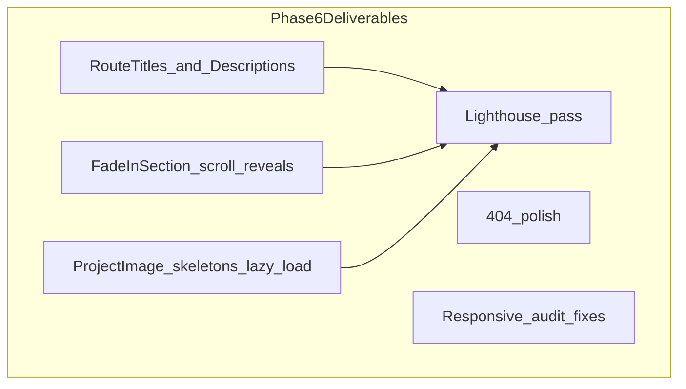

# Phase 6 — Motion, Responsiveness & Polish (Detailed Plan)

## Goal

Elevate the site from "feature-complete" to **production-ready feel** — smooth motion, polished loading states, correct page titles, and verified accessibility/responsiveness. After Phase 6, the portfolio should pass a manual Lighthouse audit at acceptable scores.

**In scope:** motion utilities, image skeletons, route metadata, 404 polish, responsive fixes, hover refinements, Lighthouse checklist.  
**Out of scope:** Open Graph images/tags, `robots.txt`, `sitemap.xml`, real screenshots (Phase 7); Vercel deploy (Phase 8).



---

## Starting point

| Area                     | Current state                                                                                      |
| ------------------------ | -------------------------------------------------------------------------------------------------- |
| Motion                   | Journey [`Timeline.tsx`](src/components/journey/Timeline.tsx) only; `framer-motion` installed      |
| Reduced motion           | [`globals.css`](src/styles/globals.css) disables CSS animations; Journey uses `useReducedMotion()` |
| Page titles              | Static in [`index.html`](index.html) — never updates on navigation                                 |
| Meta description         | None                                                                                               |
| `ProjectImage`           | Jumps to placeholder on error; no loading state                                                    |
| 404                      | Basic [`NotFoundPage.tsx`](src/pages/NotFoundPage.tsx) — functional, minimal                       |
| Lazy loading             | Images load eagerly                                                                                |
| `prefers-reduced-motion` | Global CSS `!important` may conflict with some Tailwind hovers — audit needed                      |

---

## Step 1 — Route metadata system

No new dependency — lightweight hooks (Phase 7 adds full OG via same pattern or `react-helmet-async`).

### [`src/config/seo.ts`](src/config/seo.ts) (new)

Central title/description map:

```ts
export const defaultSeo = {
  title: 'Aron Arboleda | Software Developer',
  description: 'Portfolio of Aron Rez D. Arboleda — ...',
}

export const routeSeo: Record<string, { title: string; description: string }> = {
  '/': { title: '...', description: '...' },
  '/about': { ... },
  '/journey': { ... },
  '/projects': { ... },
  '/experience': { ... },
  '/contact': { ... },
}
```

Project pages: dynamic title from `getProjectBySlug` → `"{title} | Aron Arboleda"`.

### [`src/hooks/usePageMeta.ts`](src/hooks/usePageMeta.ts) (new)

```ts
export function usePageMeta(title: string, description?: string): void;
```

On mount + cleanup:

- `document.title = title`
- Create/update `<meta name="description" content="...">` in `document.head`
- On unmount, restore `defaultSeo` (or leave for next page to overwrite)

### Integration

| Page                                                   | Hook call                                                             |
| ------------------------------------------------------ | --------------------------------------------------------------------- |
| [`HomePage`](src/pages/HomePage.tsx)                   | `usePageMeta(routeSeo['/'].title, ...)`                               |
| About, Journey, Projects, Experience, Contact          | matching `routeSeo` entry                                             |
| [`ProjectDetailPage`](src/pages/ProjectDetailPage.tsx) | `usePageMeta(\`${project.title} \| Aron Arboleda\`, project.tagline)` |
| [`NotFoundPage`](src/pages/NotFoundPage.tsx)           | `Page not found \| Aron Arboleda`                                     |

Alternative: single [`PageMeta`](src/components/layout/PageMeta.tsx) component used at top of each page — same effect, more declarative. **Recommendation:** hook (less JSX noise).

Update [`index.html`](index.html) default `<meta name="description">` to match `defaultSeo.description` for first paint before JS hydrates.

---

## Step 2 — Scroll-reveal motion (`FadeInSection`)

### [`src/components/ui/FadeInSection.tsx`](src/components/ui/FadeInSection.tsx) (new)

Reusable wrapper using existing `framer-motion`:

```tsx
type FadeInSectionProps = {
  children: ReactNode;
  delay?: number;
  className?: string;
  as?: "div" | "section";
};
```

- `initial={{ opacity: 0, y: 20 }}`
- `whileInView={{ opacity: 1, y: 0 }}`
- `viewport={{ once: true, margin: '-40px' }}`
- `transition={{ duration: 0.45, delay }}`
- If `useReducedMotion()` → render static wrapper, no animation

### Where to apply (stagger via `delay={index * 0.06}`)

| Page / component                                 | Targets                                                                                              |
| ------------------------------------------------ | ---------------------------------------------------------------------------------------------------- |
| [`HomePage`](src/pages/HomePage.tsx)             | Featured grid cards, "What I build" cards, skills grid, journey CTA                                  |
| [`AboutPage`](src/pages/AboutPage.tsx)           | Education cards, certificate list, org cards                                                         |
| [`ProjectsPage`](src/pages/ProjectsPage.tsx)     | Wrap each `ProjectCard` in grid (or stagger inside `ProjectGrid`)                                    |
| [`ExperiencePage`](src/pages/ExperiencePage.tsx) | Each `ExperienceCard`                                                                                |
| [`ContactPage`](src/pages/ContactPage.tsx)       | Info + form columns                                                                                  |
| Project detail sections                          | Optional light fade on `ProjectOverview`, `ProjectFeatures` — **low priority**; hero stays immediate |

**Do not** re-animate Journey `Timeline` — already has its own motion.

### Optional: [`src/hooks/useScrollReveal.ts`](src/hooks/useScrollReveal.ts)

Thin re-export or custom hook if needed later — **skip** unless `FadeInSection` is insufficient. Keep one abstraction only.

---

## Step 3 — Image loading skeletons

### [`src/components/ui/Skeleton.tsx`](src/components/ui/Skeleton.tsx) (new)

```tsx
// Pulsing block: animate-pulse bg-surface-muted rounded-card
```

### Upgrade [`ProjectImage.tsx`](src/components/projects/ProjectImage.tsx)

State machine: `loading | loaded | error`

```
loading → show Skeleton (same aspect-ratio box)
onLoad  → fade in  (opacity transition)
onError → ProjectImagePlaceholder (existing)
```

Props addition: `loading?: 'eager' | 'lazy'` (default `'lazy'` for below-fold; hero images pass `loading="eager"`).

### Usage updates

| Location                 | `loading` |
| ------------------------ | --------- |
| `ProjectDetailHero` hero | `eager`   |
| `ProjectCard` thumbnails | `lazy`    |
| `ProjectGallery` grid    | `lazy`    |

Add `decoding="async"` on `` for performance.

---

## Step 4 — Hover & interaction polish

Audit and standardize transitions (target: `duration-200` or `duration-300`):

| Component                                                                                         | Enhancement                                                                  |
| ------------------------------------------------------------------------------------------------- | ---------------------------------------------------------------------------- |
| [`Card.tsx`](src/components/ui/Card.tsx)                                                          | Ensure `hover` prop adds consistent `transition-shadow transition-transform` |
| [`ProjectFilter`](src/components/projects/ProjectFilter.tsx) chips                                | Add `transition-colors duration-200` if missing                              |
| [`Footer`](src/components/layout/Footer.tsx) / [`Header`](src/components/layout/Header.tsx) links | Verify hover color transition                                                |
| [`Button`](src/components/ui/Button.tsx) / [`ButtonLink`](src/components/ui/ButtonLink.tsx)       | Subtle `active:scale-[0.98]` on press (respect reduced motion via CSS)       |

Add to [`globals.css`](src/styles/globals.css) under reduced-motion block:

```css
@media (prefers-reduced-motion: reduce) {
  .motion-safe\:transition-transform {
    transition: none;
  }
}
```

Use `motion-safe:` Tailwind variant where scale/active effects applied.

---

## Step 5 — Enhanced 404 page

Upgrade [`NotFoundPage.tsx`](src/pages/NotFoundPage.tsx):

- Wrap in subtle [`HeroGrain`](src/components/ui/HeroGrain.tsx) or `bg-surface-muted` band (matches Home aesthetic)
- Large "404" display typography (`font-heading`, accent color)
- Helpful quick links row: Home, Projects, Contact (`ButtonLink` secondary variants)
- `usePageMeta('Page not found | Aron Arboleda', ...)`
- Optional: `FadeInSection` on content block

[`ProjectNotFound`](src/components/projects/detail/ProjectNotFound.tsx) — align styling with global 404 (shared [`NotFoundContent`](src/components/ui/NotFoundContent.tsx) optional extract to DRY).

---

## Step 6 — Responsive audit & fixes

Manual test matrix (fix issues found during implementation):

| Breakpoint | Pages to verify                                                                    |
| ---------- | ---------------------------------------------------------------------------------- |
| 375px      | Mobile nav, project filter scroll, timeline dots, contact stack, lightbox controls |
| 768px      | Project grid 2-col, about education grid                                           |
| 1280px+    | Max content width, journey timeline spacing                                        |

Known areas to check/fix:

1. **Timeline dot positioning** — [`Timeline.tsx`](src/components/journey/Timeline.tsx) absolute offsets on narrow screens
2. **ImageLightbox** — arrow buttons on mobile (already has `max-sm:` overrides — verify tap targets ≥ 44px)
3. **Project detail hero** — `max-h-[480px]` doesn't clip oddly on small screens
4. **Home featured grid** — 3 featured cards: 1 col mobile OK
5. **Long project titles** — prev/next nav truncation (`truncate` or `line-clamp-2`)

Document fixes inline — no separate test framework required for Phase 6.

---

## Step 7 — Page loading state polish

Upgrade [`PageLoading.tsx`](src/components/ui/PageLoading.tsx):

- Skeleton bars mimicking page layout (pulse rectangles) instead of dot-only
- Or keep minimal but add `role="status"` + `aria-live="polite"` for screen readers

---

## Step 8 — Accessibility quick wins

- Verify single `<h1>` per page (project detail: only in hero)
- Add `aria-current="page"` to active `NavLink` in [`Header`](src/components/layout/Header.tsx) / [`MobileNav`](src/components/layout/MobileNav.tsx) — React Router `NavLink` supports this via `aria-current` automatically when using `end` prop
- Gallery lightbox: verify focus returns to trigger on close (optional `useRef` focus restore — nice-to-have)
- Ensure all icon-only buttons have `aria-label` (audit ThemeToggle, lightbox, mobile menu)

---

## Step 9 — Lighthouse audit checklist

Run `npm run build && npm run preview`, then Chrome Lighthouse (mobile + desktop):

| Category       | Target | Actions                                                                    |
| -------------- | ------ | -------------------------------------------------------------------------- |
| Performance    | ≥ 90   | `loading="lazy"` images, font already self-hosted, code-split routes exist |
| Accessibility  | ≥ 95   | contrast, labels, heading order, skip link                                 |
| Best Practices | ≥ 95   | HTTPS on deploy (preview is http — note for Phase 8)                       |
| SEO            | ≥ 90   | per-page titles, meta description, `lang="en"`, semantic landmarks         |

**Fix list** (apply based on audit results):

- Missing `alt` on any image
- Tap target size warnings on filter chips / timeline
- Document title not updating (fixed by Step 1)

Add optional npm script:

```json
"preview": "vite preview"
```

No automated Lighthouse CI in Phase 6 — manual pass is sufficient.

---

## File structure after Phase 6

```
src/
├── config/
│   └── seo.ts                    (new)
├── hooks/
│   └── usePageMeta.ts            (new)
├── components/ui/
│   ├── FadeInSection.tsx         (new)
│   ├── Skeleton.tsx              (new)
│   └── NotFoundContent.tsx       (optional, shared 404 body)
```

**Modified:** all page files (meta hook), `ProjectImage`, `ProjectCard`, `ProjectGrid`, `PageLoading`, `NotFoundPage`, `globals.css`, `index.html`

**No new npm dependencies** (framer-motion already installed).

---

## Acceptance checklist

- [ ] `npm run build` and `npm run lint` pass
- [ ] Navigating routes updates `document.title` (check tab text)
- [ ] `/projects/u-heal` title shows "U-HEAL | Aron Arboleda"
- [ ] Meta description updates per page (DevTools → Elements → `<meta name="description">`)
- [ ] `FadeInSection` animates Home/About/Projects sections on scroll; no animation when `prefers-reduced-motion: reduce`
- [ ] `ProjectImage` shows skeleton pulse before load; lazy images below fold
- [ ] 404 page has quick links + polished layout
- [ ] Mobile (375px): no horizontal overflow on any main page
- [ ] Lighthouse mobile: Performance ≥ 85, Accessibility ≥ 95, SEO ≥ 90 (on preview build)
- [ ] Journey timeline still animates correctly (no double-animation conflict)

---

## Implementation order (for execution prompt)

1. `src/config/seo.ts` + `usePageMeta` + wire all pages + `index.html` meta
2. `Skeleton` + upgrade `ProjectImage` (loading/lazy/decoding)
3. `FadeInSection` + apply to Home, About, Projects, Experience, Contact
4. Hover polish pass (Card, buttons, filter chips)
5. Enhanced 404 (+ optional shared `NotFoundContent`)
6. `PageLoading` a11y + skeleton polish
7. Responsive audit + targeted CSS fixes
8. Lighthouse run + fix flagged issues
9. Build, lint, final manual walkthrough

---

## Next phase preview

**Phase 7** adds real assets (`public/images/`), custom favicon, `robots.txt`, `sitemap.xml`, and Open Graph / Twitter Card meta tags per route — building on the `usePageMeta` / `seo.ts` foundation from this phase.

**Phase 8** deploys to Vercel and smoke-tests production URLs.
