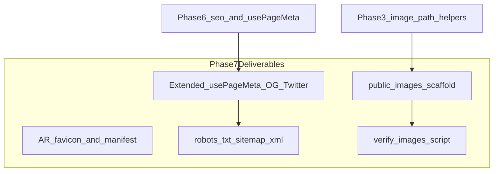

# Phase 7 — Assets, SEO & Metadata (Detailed Plan)

## Goal

Deliver **shareable links that look good on social media** and a **complete image asset pipeline** so you can drop in real screenshots without touching code. Phase 7 builds directly on Phase 6’s [`src/config/seo.ts`](src/config/seo.ts) and [`src/hooks/usePageMeta.ts`](src/hooks/usePageMeta.ts).

**In scope:** image folder scaffold + checklist, favicon, OG/Twitter meta per route, `robots.txt`, `sitemap.xml`, web manifest (PWA-lite), image verification script, branded `og-default` placeholder.

**Out of scope:** Vercel deploy and production `VITE_SITE_URL` (Phase 8), contact form backend, analytics, prerender/SSR (optional stretch only if share previews fail).



---

## Current state (starting point)

| Area           | Status                                                                                                                                     |
| -------------- | ------------------------------------------------------------------------------------------------------------------------------------------ |
| Image paths    | [`src/lib/images.ts`](src/lib/images.ts) + `buildProjectImages()` in all 11 project files — paths like `/images/projects/u-heal/hero.webp` |
| Image UI       | [`ProjectImage`](src/components/projects/ProjectImage.tsx) shows skeleton → image → `ProjectImagePlaceholder` on error                     |
| Profile        | [`ProfileAvatar`](src/components/about/ProfileAvatar.tsx) expects `/images/profile/aron-portrait.webp`                                     |
| Meta (runtime) | `usePageMeta` sets `document.title` + `meta[name=description]` only                                                                        |
| `public/`      | Only [`favicon.svg`](public/favicon.svg) (still **Vite default**, purple) and `icons.svg` — **no `public/images/` yet**                    |
| Crawlers       | No `robots.txt`, no `sitemap.xml`, no OG/Twitter tags                                                                                      |
| Site URL       | No config; you chose **localhost for dev**, real URL at deploy (Phase 8)                                                                   |

---

## 1. Site URL strategy

Add [`src/config/site.ts`](src/config/site.ts) (or extend `seo.ts`):

```ts
export const siteUrl =
  import.meta.env.VITE_SITE_URL?.replace(/\/$/, '') ??
  (typeof window !== 'undefined'
    ? window.location.origin
    : 'http://localhost:4173')
```

Add [`src/lib/urls.ts`](src/lib/urls.ts):

- `absoluteUrl(path: string)` — joins `siteUrl` + path for build-time artifacts (sitemap)
- `toAbsoluteImageUrl(path: string)` — for OG images; at runtime prefer `new URL(path, window.location.origin).href` so dev preview works without env vars

**Phase 8 note:** Set `VITE_SITE_URL=https://your-domain.vercel.app` in Vercel env before production sitemap generation. Until then, local `npm run preview` OG previews work via runtime `window.location.origin`.

---

## 2. Extend SEO config and `usePageMeta`

### Expand [`src/config/seo.ts`](src/config/seo.ts)

Add shared constants:

```ts
export const defaultOgImage = '/images/og-default.webp'
export const siteName = 'Aron Arboleda'
export const twitterHandle = undefined // add @handle later if desired
```

Add helpers:

- `projectPageMeta(project)` → `{ title, description, image: project.images.hero, path: `/projects/${slug}`, type: 'article' }`
- `routeMeta` objects gain optional `image` + `path` where useful (e.g. About could use profile photo)

### Upgrade [`src/hooks/usePageMeta.ts`](src/hooks/usePageMeta.ts)

Accept a `PageMeta` object (backward-compatible overload: `(title, description?)` still works):

| Tag                                                       | Value                                           |
| --------------------------------------------------------- | ----------------------------------------------- |
| `og:title`                                                | page title                                      |
| `og:description`                                          | description                                     |
| `og:image`                                                | absolute URL (project hero or `defaultOgImage`) |
| `og:url`                                                  | `window.location.href`                          |
| `og:type`                                                 | `website` or `article` (projects)               |
| `og:site_name`                                            | `Aron Arboleda`                                 |
| `twitter:card`                                            | `summary_large_image`                           |
| `twitter:title` / `twitter:description` / `twitter:image` | mirror OG                                       |
| `link[rel=canonical]``                                    | current pathname canonical                      |

Implementation pattern: small `upsertMeta(property, content)` / `upsertLink(rel, href)` helpers that create or update head tags; cleanup previous values on route change via `useEffect` return.

### Static defaults in [`index.html`](index.html)

Duplicate **home page** OG/Twitter tags in HTML so crawlers that never run JS still get reasonable previews for `/`:

```html
<meta property="og:title" content="Aron Arboleda | Software Developer" />
<meta property="og:image" content="/images/og-default.webp" />
<meta name="twitter:card" content="summary_large_image" />
```

(Runtime `usePageMeta` overrides these after hydration for in-app navigation.)

### Wire all routes

| Page                                                     | Meta source                | OG image              |
| -------------------------------------------------------- | -------------------------- | --------------------- |
| Home, About, Journey, Projects, Experience, Contact, 404 | `routeSeo.*`               | `defaultOgImage`      |
| About (optional enhancement)                             | same                       | `profileImagePath()`  |
| Project detail                                           | `projectPageMeta(project)` | `project.images.hero` |

Update [`ProjectDetailLayout`](src/components/projects/detail/ProjectDetailLayout.tsx) from:

```ts
usePageMeta(projectPageTitle(project.title), project.tagline)
```

to full `projectPageMeta(project)`.

**SPA caveat (document in plan, not a blocker):** LinkedIn/Facebook bots may not execute JS; per-route OG for `/projects/u-heal` may not preview until prerender or SSR. Twitter, Slack, Discord, and iMessage generally work with client-side meta. Acceptance test includes manual share-debugger check; prerender is a **stretch goal** only if previews fail.

---

## 3. Image asset scaffold (you provide files, we provide structure)

### Directory layout

Create under `public/images/`:

```
public/images/
├── og-default.webp          # branded placeholder (agent-generated until you replace)
├── profile/
│   └── aron-portrait.webp   # you provide
└── projects/
    ├── u-heal/
    ├── liquefact/
    ├── draft2dimen-v2/
    ├── gas-smoke-detector/
    ├── draft2dimen/
    ├── liwanag-at-dunong/
    ├── rebyu/
    ├── spell/
    ├── nom-vet/
    ├── reminders-builder/
    └── raite-hackathon/
```

Each project folder gets a `.gitkeep` until images exist. **No code changes** needed when you add files — paths already match [`portfolio_master_plan`](.cursor/plans/portfolio_master_plan_3bac133b.plan.md) asset table.

### User checklist — [`public/images/README.md`](public/images/README.md)

Copy the master plan’s per-project filename table (hero + gallery filenames). Include specs:

- Format: **WebP**, max width **1920px**, compressed
- Profile: **800×800**
- OG default: **1200×630**
- Naming must match existing `buildProjectImages()` calls (e.g. u-heal: `hero.webp`, `mobile-1.webp`, `mobile-2.webp`, `dashboard.webp`, `ai-analysis.webp`)

### Branded `og-default.webp`

Agent creates a simple 1200×630 placeholder matching design tokens (`--accent` amber, `--surface`, Instrument Serif “Aron Arboleda” + tagline) so share previews work before you supply a custom OG image.

### Optional resume asset

`public/Aron_Arboleda_Resume.pdf` — only wire a download button if you add the file (defer unless requested).

---

## 4. Favicon and web manifest

### Replace [`public/favicon.svg`](public/favicon.svg)

Match the Header AR monogram: rounded square, amber border, “AR” initials — **not** the current Vite purple logo.

Add PNG fallbacks for older clients (optional, lightweight):

- `public/favicon-32x32.png`
- `public/apple-touch-icon.png` (180×180)

### Add [`public/site.webmanifest`](public/site.webmanifest)

```json
{
  "name": "Aron Arboleda",
  "short_name": "Aron Arboleda",
  "start_url": "/",
  "display": "standalone",
  "background_color": "#faf9f7",
  "theme_color": "#c4956a",
  "icons": [{ "src": "/favicon.svg", "sizes": "any", "type": "image/svg+xml" }]
}
```

Wire in [`index.html`](index.html):

```html
<link rel="manifest" href="/site.webmanifest" />
<link rel="apple-touch-icon" href="/apple-touch-icon.png" />
```

---

## 5. `robots.txt` and `sitemap.xml`

### [`public/robots.txt`](public/robots.txt) (static)

```
User-agent: *
Allow: /

Sitemap: {SITE_URL}/sitemap.xml
```

Use a placeholder `Sitemap:` line with a comment: _“Regenerated at build; set VITE_SITE_URL for production.”_ Or generate `robots.txt` alongside sitemap in the build script so both stay in sync.

### Build-time sitemap — [`scripts/generate-sitemap.ts`](scripts/generate-sitemap.ts)

Run via `"prebuild": "tsx scripts/generate-sitemap.ts"` (add `tsx` devDependency).

**URLs to include (18 total):**

- `/`, `/about`, `/journey`, `/projects`, `/experience`, `/contact`
- `/projects/{slug}` for all 11 slugs from [`getAllProjectSlugs()`](src/data/projects/index.ts)

Output: [`public/sitemap.xml`](public/sitemap.xml) with `<loc>`, `<lastmod>` (build date), `<changefreq>monthly</changefreq>`, `<priority>` (home `1.0`, projects `0.8`, others `0.7`).

**Base URL:** `process.env.VITE_SITE_URL ?? 'http://localhost:4173'` per your preference — regenerate on Vercel in Phase 8 with the real domain.

Import project slugs by either:

- Duplicating the slug list in the script (simple), or
- Running the script as ESM that imports from `src/data/projects/index.ts` (preferred, single source of truth)

---

## 6. Image verification script

Add [`scripts/verify-images.ts`](scripts/verify-images.ts):

- Reads all projects from data layer
- Checks `public/images/profile/aron-portrait.webp`
- Checks `public/images/og-default.webp`
- For each project: `hero.webp` + every gallery filename derived from paths
- Prints missing files table; **exit 1** if any missing (for CI/pre-deploy)

Add npm script: `"verify:images": "tsx scripts/verify-images.ts"` — run manually as you add assets; **do not** add to `prebuild` until you’ve uploaded images (otherwise builds fail). Optional: `"verify:images:warn"` mode that logs but doesn’t fail.

Extend [`validate.ts`](src/data/projects/validate.ts) in dev only: optional console warning listing expected filenames (no fs access in browser bundle).

---

## 7. Minor component tweaks (only if needed)

- [`ProfileAvatar`](src/components/about/ProfileAvatar.tsx): add `loading="eager"` + `decoding="async"` once real portrait exists
- [`ProjectDetailHero`](src/components/projects/detail/ProjectDetailHero.tsx) / [`ProjectCard`](src/components/projects/ProjectCard.tsx): confirm `loading="eager"` on hero images (likely already set from Phase 6)
- No changes to `ProjectImagePlaceholder` — keep as fallback until files exist

---

## 8. Implementation order

1. `siteUrl` config + `urls.ts` helpers
2. Extend `seo.ts` with `defaultOgImage`, `projectPageMeta`, route paths
3. Upgrade `usePageMeta` with OG/Twitter/canonical tag management
4. Wire all pages + `ProjectDetailLayout`; update `index.html` static OG defaults
5. Scaffold `public/images/` + `README.md` + branded `og-default.webp`
6. Replace favicon + add `site.webmanifest` + apple-touch-icon
7. Add `robots.txt` + `generate-sitemap.ts` + `prebuild` hook
8. Add `verify-images.ts` script
9. `npm run build` + `npm run lint` + manual acceptance tests

---

## 9. Acceptance tests

### Code / build

- [ ] `npm run build` succeeds; `public/sitemap.xml` is generated with 18 URLs
- [ ] `npm run lint` passes
- [ ] `robots.txt` references sitemap URL
- [ ] Favicon shows AR monogram (not Vite logo) in browser tab

### Meta tags (DevTools → Elements → `<head>`)

- [ ] `/` — title, description, `og:image` → `/images/og-default.webp` (absolute at runtime)
- [ ] `/projects/u-heal` — title `U-HEAL | Aron Arboleda`, `og:image` → hero path, `og:type` → `article`
- [ ] Navigate Home → About → back: tags update without stale values from previous route
- [ ] `index.html` contains static OG tags for home (view page source)

### Images

- [ ] With no project images present: placeholders still render (no regression)
- [ ] After dropping `public/images/projects/u-heal/hero.webp`: hero shows real image on card + detail page
- [ ] `npm run verify:images` lists all expected files; passes once you’ve added assets you intend to ship

### Share preview (manual)

- [ ] Paste preview URL in [opengraph.xyz](https://www.opengraph.xyz/) or Twitter Card Validator while `npm run preview` is running — home page shows title, description, image
- [ ] Document result for one project URL (may vary by crawler — see SPA caveat)

### SEO files

- [ ] `GET /robots.txt` and `GET /sitemap.xml` return valid content on preview server
- [ ] Sitemap URLs use `localhost:4173` until `VITE_SITE_URL` is set in Phase 8

---

## 10. What you do vs what we build

| You                                              | We build                                   |
| ------------------------------------------------ | ------------------------------------------ |
| Profile photo, project screenshots (WebP)        | Folder scaffold + README checklist         |
| Custom OG image (optional, replaces placeholder) | Branded `og-default.webp` placeholder      |
| Set `VITE_SITE_URL` on Vercel (Phase 8)          | Sitemap/robots generation wired to env var |
| Drop files into `public/images/...`              | Verification script + no path code changes |

---

## 11. Stretch goal (only if share previews fail)

If LinkedIn/Facebook cannot read project-level OG tags after Phase 7:

- Evaluate `vite-plugin-prerender` to statically emit HTML for `/` + all `/projects/:slug` routes at build time, **or**
- Defer to a future SSR migration

Not in the default Phase 7 scope — client-side meta is sufficient for most personal portfolios.

---

## Next phase preview

**Phase 8** connects the repo to Vercel, sets `VITE_SITE_URL` to the production domain, regenerates sitemap, deploys, and smoke-tests all routes + share links on the live URL.
