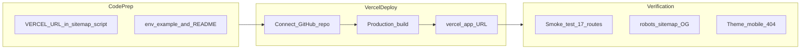

# Phase 8 — Deployment & Verification (Detailed Plan)

## Goal

Get the portfolio **live on Vercel** at a `*.vercel.app` URL with correct SPA routing, production sitemap/robots, and verified behavior across all pages. No custom domain in this phase.

**In scope:** Vercel project setup (GitHub connect), build/deploy config, auto-detect production URL for sitemap, `.env.example`, README deploy docs, production smoke-test checklist.

**Out of scope:** Custom domain DNS, analytics, contact form backend, prerender/SSR, filling real project images (Phase 9 / ongoing).



---

## Current state (starting point)

| Item               | Status                                                                                                                         |
| ------------------ | ------------------------------------------------------------------------------------------------------------------------------ |
| SPA routing        | [`vercel.json`](vercel.json) — catch-all rewrite to `/index.html`                                                              |
| Build              | `npm run build` → `tsc -b && vite build`; `prebuild` generates sitemap                                                         |
| Site URL (runtime) | [`getSiteOrigin()`](src/config/site.ts) uses `VITE_SITE_URL` or `window.location.origin` — **works on production without env** |
| Sitemap (build)    | [`scripts/generate-sitemap.ts`](scripts/generate-sitemap.ts) defaults to `http://localhost:4173` unless `VITE_SITE_URL` is set |
| GitHub             | **Repo is on GitHub and ready to connect** (per your answer)                                                                   |
| README             | Still the default Vite template — needs portfolio + deploy docs                                                                |
| CI                 | No GitHub Actions workflow                                                                                                     |

---

## 1. Pre-deploy code changes (we build)

### 1a. Auto-detect Vercel URL in sitemap script

Update [`scripts/generate-sitemap.ts`](scripts/generate-sitemap.ts) so the first deploy produces correct `sitemap.xml` and `robots.txt` **without** manually setting `VITE_SITE_URL`:

```ts
function getBuildSiteUrl(): string {
  const explicit = process.env.VITE_SITE_URL?.replace(/\/$/, "");
  if (explicit) return explicit;
  const production = process.env.VERCEL_PROJECT_PRODUCTION_URL;
  if (production) return `https://${production}`;
  const preview = process.env.VERCEL_URL;
  if (preview) return `https://${preview}`;
  return "http://localhost:4173";
}
```

Vercel injects `VERCEL_PROJECT_PRODUCTION_URL` and `VERCEL_URL` at build time. Priority: explicit `VITE_SITE_URL` > production domain > preview URL > localhost.

### 1b. Add `.env.example`

```
# Optional — overrides auto-detected Vercel URL for sitemap generation and baked-in meta
# VITE_SITE_URL=https://your-project.vercel.app
```

Add `.env` to `.gitignore` if not already present.

### 1c. Update [`README.md`](README.md)

Replace Vite boilerplate with:

- Project title + one-line description
- Local dev: `npm install`, `npm run dev`, `npm run build`, `npm run preview`
- Deploy: link to Vercel, note that pushes to `main` auto-deploy
- Env vars: optional `VITE_SITE_URL`
- Image assets: pointer to [`public/images/README.md`](public/images/README.md)
- Scripts: `verify:images`, `verify:images:warn`

### 1d. Optional `vercel.json` explicit config

Current rewrite is sufficient. Optionally add for clarity (Vercel auto-detects Vite otherwise):

```json
{
  "buildCommand": "npm run build",
  "outputDirectory": "dist",
  "framework": "vite",
  "rewrites": [{"source": "/(.*)", "destination": "/index.html"}]
}
```

Not required if dashboard auto-detection works — verify on first deploy.

---

## 2. Vercel project setup (you do in dashboard)

### Step-by-step

1. Go to [vercel.com](https://vercel.com) → **Add New Project**
2. **Import** the GitHub repository (`Portfolio` or your repo name)
3. Framework preset: **Vite** (should auto-detect)
4. Confirm settings:
   - **Build Command:** `npm run build`
   - **Output Directory:** `dist`
   - **Install Command:** `npm install`
5. **Environment Variables** (optional for first deploy):
   - Skip `VITE_SITE_URL` initially — sitemap script will use `VERCEL_PROJECT_PRODUCTION_URL` after code change in §1a
   - Add later only if you want a fixed canonical base before Vercel assigns the URL
6. Click **Deploy** — wait for build log to show `prebuild` → `Generated sitemap.xml and robots.txt (17 URLs, base: https://…vercel.app)`
7. Note the assigned URL: `https://<project-name>.vercel.app`

### Branch and auto-deploy

- Production branch: **`main`** (or your default branch)
- Every push to `main` triggers a new production deployment
- PRs get preview deployments automatically (optional smoke test on previews)

### No secrets required

Static SPA — no API keys, database, or server env vars needed for Phase 8.

---

## 3. Post-deploy verification (production URL)

Base URL: `https://<your-project>.vercel.app`

### 3a. Static / SEO files

| Check      | URL                       | Expected                                                               |
| ---------- | ------------------------- | ---------------------------------------------------------------------- |
| Home loads | `/`                       | Hero, featured projects, no console errors                             |
| Robots     | `/robots.txt`             | `Allow: /` + `Sitemap: https://<domain>/sitemap.xml`                   |
| Sitemap    | `/sitemap.xml`            | 17 `<loc>` entries with **production** `https://` URLs (not localhost) |
| Favicon    | `/favicon.svg`            | AR monogram in browser tab                                             |
| OG image   | `/images/og-default.webp` | Returns 200                                                            |
| Manifest   | `/site.webmanifest`       | Valid JSON                                                             |

### 3b. Core routes (6)

| Route         | Checks                                                 |
| ------------- | ------------------------------------------------------ |
| `/`           | Featured projects, skills, journey CTA                 |
| `/about`      | Bio, education, certs, profile avatar (placeholder OK) |
| `/journey`    | Timeline renders, scroll OK                            |
| `/projects`   | Grid + filter chips; `?category=web` filter works      |
| `/experience` | Freelance cards                                        |
| `/contact`    | Mailto links, form UI                                  |

### 3c. Project detail routes (11)

Hit each slug — title in tab, hero/placeholder, prev/next nav, no crash:

`u-heal`, `liquefact`, `draft2dimen-v2`, `gas-smoke-detector`, `draft2dimen`, `liwanag-at-dunong`, `rebyu`, `spell`, `nom-vet`, `reminders-builder`, `raite-hackathon`

Also test:

- `/projects/invalid-slug` → project 404 with link back
- `/does-not-exist` → global 404

### 3d. Client-side behavior

| Check          | How                                                                             |
| -------------- | ------------------------------------------------------------------------------- |
| SPA deep links | Open `/projects/u-heal` directly in a new tab (not via in-app nav) — page loads |
| Theme toggle   | Light / dark / system persists after refresh                                    |
| Mobile nav     | 375px width — drawer opens/closes, links work                                   |
| Page meta      | DevTools → `<head>` on `/projects/u-heal` — `og:title`, `og:image`, canonical   |
| Back/forward   | Browser back from project detail → projects grid                                |

### 3e. Share preview (manual)

Paste production `/` URL into [opengraph.xyz](https://www.opengraph.xyz/) — title, description, and OG image should appear. Project URLs may vary by crawler (SPA caveat from Phase 7).

### 3f. Build log sanity

On Vercel deployment → **Building** tab:

- `prebuild` runs `generate-sitemap.ts` successfully
- `tsc -b && vite build` completes
- No failed `verify:images` in build (it is **not** in `prebuild` — correct)

---

## 4. Troubleshooting reference

| Symptom                        | Fix                                                                        |
| ------------------------------ | -------------------------------------------------------------------------- |
| 404 on refresh / direct URL    | Confirm [`vercel.json`](vercel.json) rewrite is deployed                   |
| Sitemap shows `localhost:4173` | Ensure §1a code is merged; redeploy; or set `VITE_SITE_URL` in Vercel env  |
| Blank page / white screen      | Check Vercel build logs for TypeScript errors; run `npm run build` locally |
| Images broken                  | Expected until you add WebP files — placeholders should still render       |
| Wrong Node version             | Set **Node.js 20.x** in Vercel project Settings → General if build fails   |

---

## 5. Implementation order

1. Update `generate-sitemap.ts` with Vercel URL auto-detection
2. Add `.env.example`; confirm `.gitignore` covers `.env`
3. Rewrite `README.md` with dev + deploy instructions
4. Run `npm run build` and `npm run lint` locally
5. Commit and push to `main` (or merge PR)
6. Connect repo in Vercel dashboard → deploy
7. Run full smoke-test checklist on live `*.vercel.app` URL
8. Optionally set `VITE_SITE_URL` in Vercel if you ever need a fixed URL before deploy (usually unnecessary after §1a)

---

## 6. Acceptance criteria

- [ ] Production URL loads over HTTPS
- [ ] All 6 core routes + 11 project slugs work via direct navigation
- [ ] Global and project 404 pages work
- [ ] `/robots.txt` and `/sitemap.xml` use production domain (17 URLs)
- [ ] Theme toggle and mobile nav work on production
- [ ] `npm run build` passes locally before push
- [ ] README documents how to run and deploy the project
- [ ] Auto-deploy on push to `main` confirmed

---

## 7. What you do vs what we build

| You                                                      | We build                                  |
| -------------------------------------------------------- | ----------------------------------------- |
| Connect GitHub repo in Vercel dashboard                  | Sitemap Vercel URL auto-detection         |
| Trigger first deploy / push to `main`                    | `.env.example`, README deploy docs        |
| Run smoke tests on live URL                              | Local build/lint verification before push |
| Add project screenshots when ready (optional pre-launch) | —                                         |

---

## 8. Next phase preview

**Phase 9** (post-launch): fill project narratives, add real images, optional Vercel Analytics, contact form backend (Formspree/Web3Forms), custom domain if desired later.
