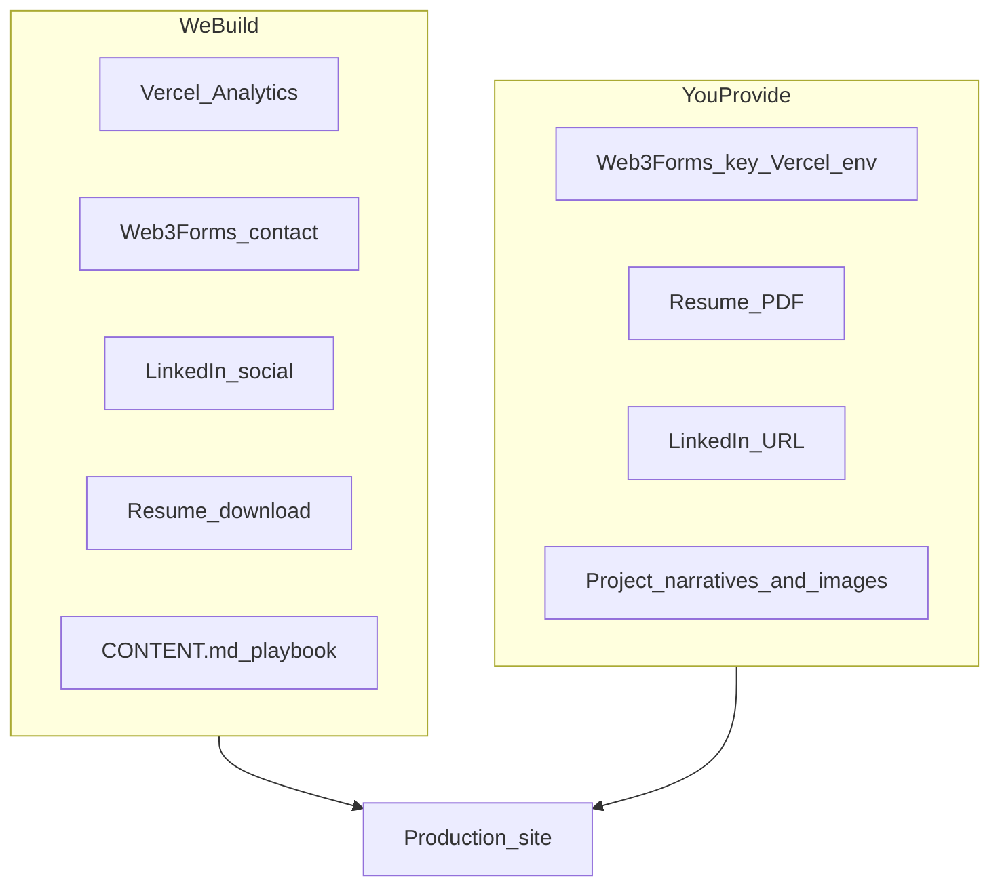

# Phase 9 — Post-Launch (Detailed Plan)

## Goal

Turn the live portfolio from **deployed and functional** into **personally complete and measurable** — with real contact delivery, analytics, professional links, resume download, and a clear guide for filling in project stories and screenshots.

**In scope (code):** Vercel Analytics, Web3Forms contact form, LinkedIn in [`profile.ts`](src/data/profile.ts), resume download button, content-editing guide.

**In scope (you):** LinkedIn URL, Web3Forms access key, resume PDF, project narratives, screenshots.

**Out of scope:** Blog/writing section, custom domain, prerender/SSR, Plausible analytics.



---

## Current state

| Area                | Status                                                                                                                 |
| ------------------- | ---------------------------------------------------------------------------------------------------------------------- |
| Contact form        | [`ContactForm.tsx`](src/components/contact/ContactForm.tsx) — **mailto only**                                          |
| Analytics           | Not installed                                                                                                          |
| Socials             | Email + GitHub in [`profile.ts`](src/data/profile.ts); **no LinkedIn**                                                 |
| Resume              | Master plan mentions `public/Aron_Arboleda_Resume.pdf` — **no download UI**                                            |
| Project reflections | All 11 projects use `PLACEHOLDER_CHALLENGES` / `PLACEHOLDER_LEARNINGS` from [`shared.ts`](src/data/projects/shared.ts) |
| Images              | Most project WebP files still missing (placeholders work)                                                              |
| Env vars            | [`.env.example`](.env.example) has only `VITE_SITE_URL`                                                                |

---

## Track 1 — Vercel Analytics

### Code changes

1. Install `@vercel/analytics`
2. Add `<Analytics />` to [`RootLayout.tsx`](src/components/layout/RootLayout.tsx) (after `<Footer />` or wrapping the layout — standard pattern):

```tsx
import {Analytics} from "@vercel/analytics/react";

// inside RootLayout return:
<Analytics />;
```

3. Document in README: enable **Web Analytics** in Vercel project → Settings → Analytics (if not auto-enabled on first deploy with the package)

### Notes

- No env vars required for basic pageview tracking on Vercel
- Works on `*.vercel.app` and custom domains once enabled
- Privacy-friendly default; no cookie banner needed for basic Vercel Analytics

### Acceptance

- [ ] Package in `package.json`
- [ ] No build/lint errors
- [ ] Vercel dashboard shows pageviews after visiting production URL (may take a few minutes)

---

## Track 2 — Contact form backend (Web3Forms)

**Why Web3Forms:** Free tier, no backend, single access key via `VITE_` env on Vercel — fits static Vite SPA better than maintaining a custom API.

### Code changes

1. **Env config**
   - Add to [`.env.example`](.env.example):
     ```
     VITE_WEB3FORMS_ACCESS_KEY=your_access_key_here
     ```
   - User creates key at [web3forms.com](https://web3forms.com) and adds to Vercel env vars

2. **Refactor [`ContactForm.tsx`](src/components/contact/ContactForm.tsx)**
   - If `import.meta.env.VITE_WEB3FORMS_ACCESS_KEY` is set:
     - `POST https://api.web3forms.com/submit` with `{ access_key, name, email, message, subject }`
     - UI states: `idle` | `submitting` | `success` | `error`
     - Disable submit button while submitting
     - Success message: "Message sent — I'll get back to you soon."
     - Error message with fallback link to `mailto:`
   - If key **not** set (local dev): keep current **mailto** behavior + small note "Form backend not configured"

3. **Accessibility**
   - `aria-live="polite"` on status region
   - `aria-busy` on form during submit

4. **README** — document Web3Forms setup steps

### User steps (manual)

1. Sign up at web3forms.com → get Access Key
2. Vercel → Project → Settings → Environment Variables → `VITE_WEB3FORMS_ACCESS_KEY`
3. Redeploy
4. Test submit on production `/contact`

### Acceptance

- [ ] Production form sends email without opening mail client
- [ ] Local dev without key still works via mailto
- [ ] Success/error states visible and accessible

---

## Track 3 — LinkedIn social link

### Code changes

1. Add LinkedIn entry to [`profile.ts`](src/data/profile.ts):

```ts
{
  label: 'LinkedIn',
  href: 'https://www.linkedin.com/in/YOUR-PROFILE', // you replace
  type: 'linkedin',
},
```

2. **Optional polish:** small [`SocialLinks`](src/components/ui/SocialLinks.tsx) component with Lucide icons (`Github`, `Linkedin`, `Mail`) used in Footer + ContactInfo — replaces plain text labels for GitHub/LinkedIn/Email. Keeps email as mailto.

3. No route changes — Footer and ContactInfo already map `profile.socials`

### User steps

- Replace placeholder LinkedIn URL with your real profile link before or after deploy

### Acceptance

- [ ] LinkedIn appears in Footer and Contact page
- [ ] Opens in new tab with `rel="noopener noreferrer"`

---

## Track 4 — Resume PDF download

### Code changes

1. Extend [`Profile`](src/types/profile.ts) type:

```ts
resumeUrl?: string  // e.g. '/Aron_Arboleda_Resume.pdf'
```

2. Add to [`profile.ts`](src/data/profile.ts):

```ts
resumeUrl: '/Aron_Arboleda_Resume.pdf',
```

3. Create [`ResumeDownload.tsx`](src/components/about/ResumeDownload.tsx):
   - Renders `ButtonLink` or `<a download>` only when `profile.resumeUrl` is defined
   - `variant="secondary"`, label "Download Resume", Lucide `Download` icon
   - `href={profile.resumeUrl}` with `download` attribute + `target="_blank"` fallback

4. **Placement**
   - [`AboutPage.tsx`](src/pages/AboutPage.tsx) — below highlights badges in hero block
   - [`HomePage.tsx`](src/pages/HomePage.tsx) — third CTA in hero: "Download Resume" (alongside View Projects / My Journey)

5. Add `public/Aron_Arboleda_Resume.pdf` placeholder note in CONTENT guide (user drops real PDF; optional `.gitkeep` or README in `public/`)

### User steps

- Export designed CV as PDF → save to `public/Aron_Arboleda_Resume.pdf`
- Commit and push (or upload via deploy)

### Acceptance

- [ ] Button visible on Home and About when `resumeUrl` set
- [ ] Clicking downloads/opens PDF on production
- [ ] Button hidden if `resumeUrl` removed from profile

---

## Track 5 — Content editing playbook (you fill, we document)

Create [`CONTENT.md`](CONTENT.md) at repo root — single source of truth for post-launch content work.

### Sections

1. **Quick wins** (do first)
   - Profile photo → `public/images/profile/aron-portrait.webp`
   - LinkedIn URL in `profile.ts`
   - Resume PDF in `public/`
   - Featured project heroes: `u-heal`, `liquefact`, `draft2dimen-v2`

2. **Per-project editing** — for each of 11 slugs, edit `src/data/projects/<slug>.ts`:
   - `overview` — 2–3 paragraphs (problem → solution → outcome)
   - `contribution` — what you specifically built
   - `challenges` — replace `PLACEHOLDER_CHALLENGES` with real bullet strings
   - `learnings` — replace `PLACEHOLDER_LEARNINGS`
   - `results` — optional metrics/awards (only `raite-hackathon` has one today)
   - `techStackDetails` — expand notes (U-HEAL already seeded as example)
   - Images — see [`public/images/README.md`](public/images/README.md)

3. **Placeholder detection** — when you replace `Add your reflections here.`, [`ProjectReflection`](src/components/projects/detail/ProjectReflection.tsx) automatically switches from dashed edit-hint card to real bullet list (`isReflectionPlaceholder` in [`lib/projects.ts`](src/lib/projects.ts))

4. **Priority order** (suggested)
   - u-heal → liquefact → draft2dimen-v2 → liwanag-at-dunong → rebyu → remainder

5. **Verify** — `npm run verify:images` after adding screenshots

### No code required for narratives

Editing data files is enough; reflection UI already handles placeholder vs real content.

---

## Track 6 — README and env updates

Update [`README.md`](README.md) with Phase 9 sections:

| Topic        | Content                                                       |
| ------------ | ------------------------------------------------------------- |
| Analytics    | Enable in Vercel dashboard; `@vercel/analytics` auto-included |
| Contact form | Web3Forms key setup                                           |
| Content      | Link to `CONTENT.md`                                          |
| Images       | Link to `public/images/README.md`                             |

Update [`.env.example`](.env.example) with `VITE_WEB3FORMS_ACCESS_KEY`.

---

## Implementation order

1. `CONTENT.md` playbook
2. LinkedIn + optional `SocialLinks` component
3. Resume type + `ResumeDownload` + About/Home placement
4. Web3Forms contact form refactor + env docs
5. `@vercel/analytics` in RootLayout
6. README + `.env.example` updates
7. `npm run build` + `npm run lint`
8. You: add env vars, PDF, LinkedIn URL, redeploy
9. Production smoke test: form submit, resume download, analytics dashboard

---

## Acceptance criteria (full Phase 9)

### Integrations

- [ ] Vercel Analytics shows traffic on production
- [ ] Contact form delivers messages via Web3Forms (not mailto) on production
- [ ] LinkedIn link works in Footer and Contact page
- [ ] Resume downloads from Home and About

### Content (ongoing — you)

- [ ] At least 1 featured project has real `challenges` + `learnings` (not placeholder)
- [ ] At least 1 featured project has `hero.webp` uploaded
- [ ] Profile photo added (optional but recommended)

### Code quality

- [ ] `npm run build` and `npm run lint` pass
- [ ] Mailto fallback works locally without Web3Forms key

---

## What you do vs what we build

| You                                  | We build                                 |
| ------------------------------------ | ---------------------------------------- |
| Web3Forms access key in Vercel env   | Form POST integration + states           |
| Enable Analytics in Vercel dashboard | `@vercel/analytics` wiring               |
| LinkedIn profile URL                 | `profile.socials` entry + optional icons |
| Resume PDF file                      | Download button on Home + About          |
| Project narratives and screenshots   | `CONTENT.md` editing guide               |
| Redeploy after env changes           | README documentation                     |

---

## Future (not Phase 9)

- **Blog / writing** — new `/writing` route + MDX or CMS if you publish later
- **Custom domain** — Vercel dashboard DNS when ready
- **Formspree** — alternative if you prefer it over Web3Forms
- **Prerender** — if LinkedIn share previews for project pages become important
