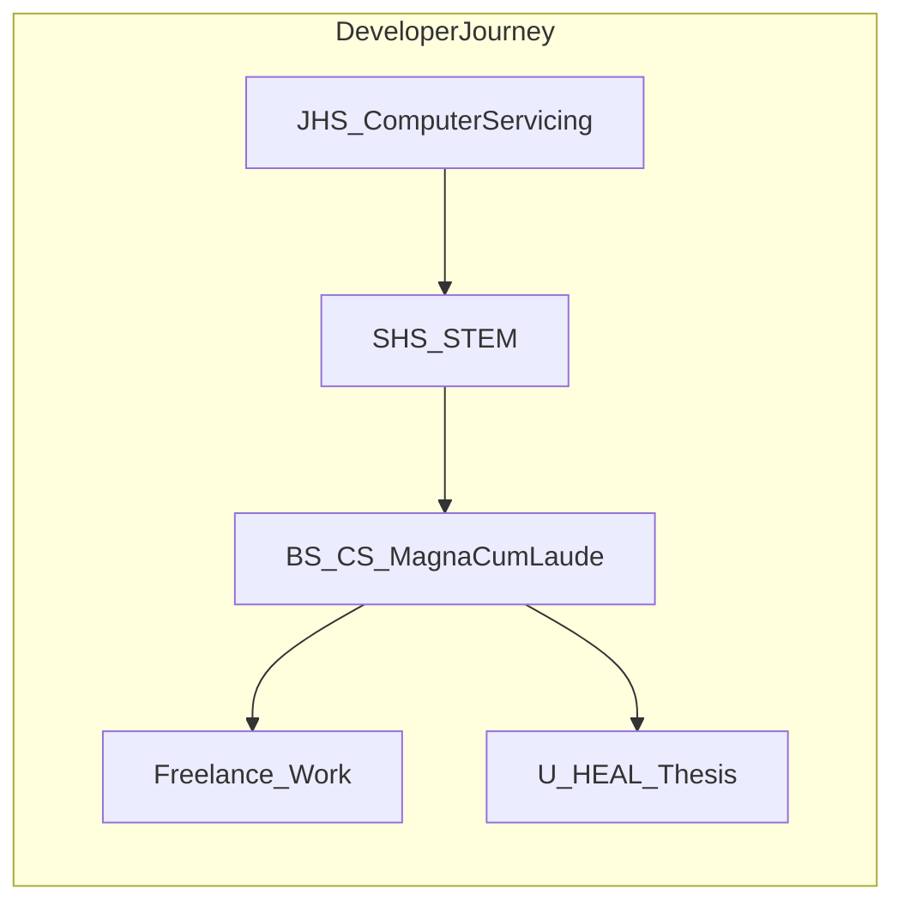
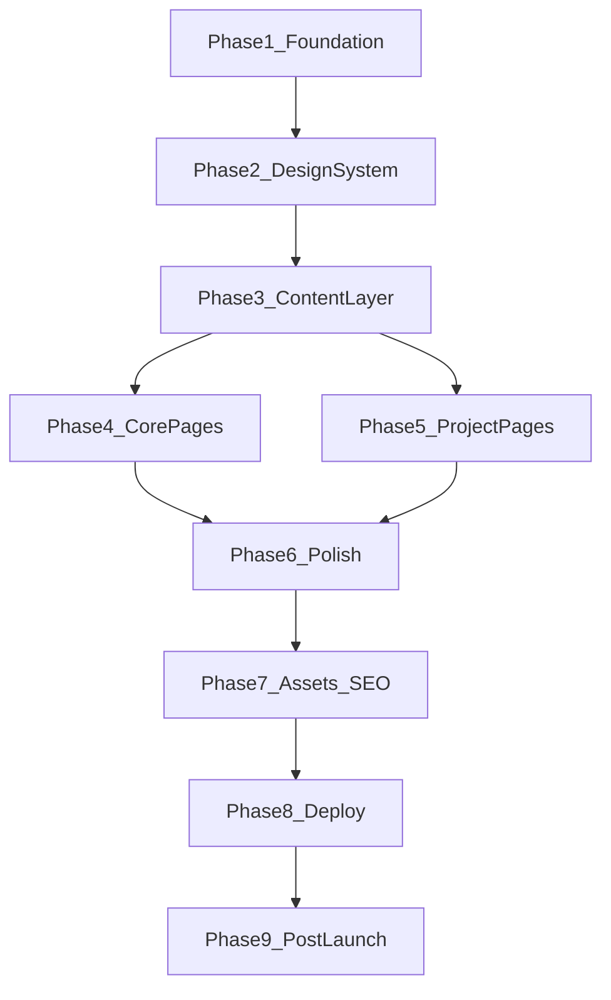

# Portfolio Website — Master Plan (Phases)

## Your story at a glance

Your CV paints a clear arc: **Computer System Servicing (JHS)** → **STEM (SHS)** → **CS Magna Cum Laude (TSU)** → **freelance + thesis work** spanning web, mobile, desktop, ML/GIS, and hardware. The site should make that progression feel intentional — not a flat project list.



---

## Tech stack (confirmed)

| Layer     | Choice                                                                                      |
| --------- | ------------------------------------------------------------------------------------------- |
| Build     | **Vite** + React 18                                                                         |
| Language  | **TypeScript** (strict)                                                                     |
| Routing   | **React Router v7**                                                                         |
| Styling   | **TailwindCSS v4** + CSS variables for theming                                              |
| Animation | **Framer Motion** (scroll reveals, page transitions)                                        |
| Icons     | **Lucide React** + simple-icons for tech logos                                              |
| Content   | TypeScript data files (`src/data/`) — easy for you to edit later                            |
| Deploy    | **Vercel** (static SPA; `vercel.json` rewrite for client routing)                           |
| Fonts     | **Instrument Serif** (headlines) + **DM Sans** (body) — editorial, human, not “AI gradient” |

---

## Site map & pages

### Global layout

- **Sticky header**: logo/name, nav links, theme toggle, mobile drawer
- **Footer**: email, GitHub, LinkedIn (you add links), copyright, “Built with React + Tailwind”
- **Page transition wrapper** + scroll-to-top on route change
- **Skip-to-content** link for accessibility

### Pages (7 route groups)

| Route             | Page                    | Purpose                                                                                             |
| ----------------- | ----------------------- | --------------------------------------------------------------------------------------------------- |
| `/`               | **Home**                | Hero, one-line positioning, 2–3 featured projects, skills snapshot, timeline teaser, CTA to contact |
| `/about`          | **About**               | Bio from objective + education cards + certificates + organizations                                 |
| `/journey`        | **Journey**             | Interactive vertical timeline: JHS → SHS → CS → orgs → competitions → freelance → thesis            |
| `/projects`       | **Projects**            | Filterable grid (Web / Mobile / Desktop / Hardware / Full-stack); sort by date                      |
| `/projects/:slug` | **Project detail** × 11 | Deep-dive template per project (you fill content)                                                   |
| `/experience`     | **Experience**          | Freelance gigs + roles with deliverable links                                                       |
| `/contact`        | **Contact**             | Form UI (mailto or Formspree later), social links, location                                         |

**Optional later**: `/resume` — PDF download once you export a designed CV.

---

## Visual direction (creative but professional)

### Design philosophy

- **Editorial developer portfolio**: generous whitespace, strong typography hierarchy, subtle texture (light grain overlay on hero only), no neon gradients or generic “SaaS landing page” look.
- **Dual theme** (your choice): CSS custom properties drive all colors; Tailwind maps to `bg-surface`, `text-primary`, `accent`, etc.
- **Accent color**: warm amber/gold (`#D4A574` range) — references “Liwanag” (light) from your NGO work without being literal; pairs well with dark charcoal and off-white.
- **Motion**: restrained — fade-up on scroll (staggered), hover lift on project cards, smooth theme transition (300ms). No excessive parallax.

### Responsive breakpoints

- Mobile-first: single column, full-width cards, hamburger nav
- `md`: 2-column project grid
- `lg`: sidebar timeline on Journey page; max content width `72rem` centered

### Reusable component architecture

```
src/
├── components/
│   ├── layout/       Header, Footer, PageShell, ThemeToggle, MobileNav
│   ├── ui/           Button, Badge, Card, SectionHeading, Tag, Divider
│   ├── projects/     ProjectCard, ProjectGrid, ProjectFilter, TechStack
│   └── journey/      Timeline, TimelineNode, MilestoneCard
├── data/
│   ├── profile.ts    name, contact, bio, socials
│   ├── education.ts
│   ├── experience.ts
│   ├── certificates.ts
│   ├── journey.ts    timeline milestones
│   └── projects/     one file per project + index.ts
├── hooks/            useTheme, useScrollReveal, useMediaQuery
├── pages/            one file per route
├── styles/           globals.css (CSS variables, grain, fonts)
└── types/            Project, Milestone, Experience, etc.
```

**Clean-code rules we'll follow in implementation:**

- Presentational components receive typed props; no inline magic strings for slugs
- Shared `Section` wrapper: `title`, `subtitle`, `children`, consistent vertical rhythm
- Project data is the single source of truth — cards and detail pages read from the same object
- `cn()` utility (clsx + tailwind-merge) for conditional classes

---

## The 11 project detail pages

Each project gets a slug, route, and a **content template** you will complete.

| #   | Project                                 | Slug                 | Type                  |
| --- | --------------------------------------- | -------------------- | --------------------- |
| 1   | U-HEAL                                  | `u-heal`             | Mobile + Web (Thesis) |
| 2   | LIQUEFACT                               | `liquefact`          | Web + ML/GIS          |
| 3   | Draft2Dimen v2                          | `draft2dimen-v2`     | Desktop               |
| 4   | Arduino Gas & Smoke                     | `gas-smoke-detector` | Hardware              |
| 5   | Draft2Dimen                             | `draft2dimen`        | Desktop               |
| 6   | Liwanag at Dunong                       | `liwanag-at-dunong`  | Full-stack Web        |
| 7   | Rebyu                                   | `rebyu`              | Full-stack Web        |
| 8   | SPELL                                   | `spell`              | Desktop               |
| 9   | Nom Veterinary Clinic                   | `nom-vet`            | Desktop               |
| 10  | Reminders Builder                       | `reminders-builder`  | Desktop               |
| 11  | _(RAITE Hackathon — optional showcase)_ | `raite-hackathon`    | Competition / Web3    |

### Project detail page template (sections you will fill)

Each `/projects/:slug` page will include these **placeholder blocks**:

1. **Hero** — title, tagline, role, date range, live demo + repo buttons
2. **Overview** — 2–3 paragraph problem/solution narrative
3. **Key features** — bullet list (from CV seed data; you expand)
4. **Tech stack** — icons + short “why this tech” notes
5. **My contribution** — what you specifically built
6. **Gallery** — 3–5 images (see asset list below)
7. **Challenges & learnings** — empty textarea-style blocks for your reflections
8. **Results / impact** — metrics, awards, user feedback (optional)
9. **Prev / Next project** — navigation footer

Seed content from [Arboleda_CV.txt](Arboleda_CV.txt) will pre-populate titles, dates, tech, links, and short descriptions so pages are never blank.

---

## Image asset plan

Store under `public/images/projects/<slug>/`. Recommended specs: **WebP**, max width 1920px, compressed.

### Global site images (you provide)

| Asset         | Path                                       | Notes                                             |
| ------------- | ------------------------------------------ | ------------------------------------------------- |
| Profile photo | `public/images/profile/aron-portrait.webp` | Professional headshot, 800×800, subtle background |
| OG default    | `public/images/og-default.webp`            | 1200×630 for social sharing                       |
| Favicon       | `public/favicon.svg`                       | Initials “AR” or monogram                         |
| Resume PDF    | `public/Aron_Arboleda_Resume.pdf`          | Optional download                                 |

### Per-project images

| Project                          | Required images                                                                     | Suggested captures                                                            |
| -------------------------------- | ----------------------------------------------------------------------------------- | ----------------------------------------------------------------------------- |
| **u-heal**                       | `hero.webp`, `mobile-1.webp`, `mobile-2.webp`, `dashboard.webp`, `ai-analysis.webp` | App home, wound doc screen, video call, web dashboard, AI segmentation result |
| **liquefact**                    | `hero.webp`, `map.webp`, `prediction.webp`, `ui-detail.webp`                        | GIS map with boreholes, ML prediction panel, form/input UI                    |
| **draft2dimen-v2**               | `hero.webp`, `calculator.webp`, `cost-report.webp`, `local-save.webp`               | Main calculator, cost computation, save feature                               |
| **draft2dimen**                  | `hero.webp`, `pdf-export.webp`, `component-calc.webp`                               | PDF output sample, column/beam calculation UI                                 |
| **gas-smoke-detector**           | `hero.webp`, `device.webp`, `wiring.webp`, `demo.webp`                              | Finished device, breadboard/circuit, serial monitor or alarm state            |
| **liwanag-at-dunong**            | `hero.webp`, `landing.webp`, `volunteer-form.webp`, `admin-dashboard.webp`          | NGO homepage, application form, admin view                                    |
| **rebyu**                        | `hero.webp`, `gameplay.webp`, `flashcards.webp`, `pixel-ui.webp`                    | Gamified study screen, deck view, pixel art UI details                        |
| **spell**                        | `hero.webp`, `editor.webp`, `grammar-check.webp`                                    | Main editor, LanguageTool suggestions                                         |
| **nom-vet**                      | `hero.webp`, `dashboard.webp`, `records.webp`                                       | Clinic management screens                                                     |
| **reminders-builder**            | `hero.webp`, `reminder-list.webp`, `create-reminder.webp`                           | List view, create/edit UI                                                     |
| **raite-hackathon** _(optional)_ | `hero.webp`, `team.webp`, `demo.webp`                                               | Hackathon project screenshot, team photo, certificate                         |

**Fallback**: Until you add real screenshots, we'll use styled placeholder components (`ProjectImagePlaceholder`) with project name + gradient — so the site looks complete during development.

---

## Journey page narrative structure

Timeline nodes (chronological), each with year, title, body, optional link:

1. **2020** — JHS, Computer System Servicing, With Honors
2. **2022** — SHS STEM, With Highest Honor
3. **2022** — Sololearn Python Intermediate
4. **2023** — Reminders Builder, Nom Vet, Sololearn JS Intermediate
5. **2023** — Programmers' Den member
6. **2024** — SPELL, Cisco CCNA courses, RAITE Hackathon
7. **2024–2025** — Liwanag at Dunong volunteer + web dev, Rebyu, Draft2Dimen v1
8. **2025** — Arduino gas/smoke project, Draft2Dimen client work
9. **2026** — U-HEAL thesis, Liquefact, Draft2Dimen v2, freelance gigs
10. **2026** — BS CS Magna Cum Laude (July)

This page is the emotional core — “path I took to become a software developer.”

---

## Implementation phases (what we do step-by-step)

You asked for a **general phase plan** now; each phase gets its own detailed plan in your next prompts.

### Phase 1 — Foundation & tooling

- Initialize Vite + React + TS project in this repo
- Configure Tailwind, ESLint, Prettier, path aliases (`@/`)
- Set up folder structure, types, `cn()` utility
- Configure React Router with lazy-loaded pages
- Add theme system (light/dark + `localStorage` persistence)
- Vercel-ready: `vercel.json` SPA fallback rewrite

**Deliverable**: Empty shell that runs locally, routes work, theme toggles.

---

### Phase 2 — Design system & layout

- CSS variables for both themes in `globals.css`
- Font loading (Instrument Serif + DM Sans)
- Build `Header`, `Footer`, `PageShell`, `Section`, `Button`, `Card`, `Badge`
- Mobile navigation drawer
- Subtle hero grain texture + focus/accessibility styles

**Deliverable**: Polished chrome you can wrap any page in.

---

### Phase 3 — Content layer & data models

- TypeScript interfaces: `Project`, `Education`, `Experience`, `Certificate`, `JourneyMilestone`
- Populate all data files from [Arboleda_CV.txt](Arboleda_CV.txt)
- Project index with filters metadata (category, featured flag, date)
- Image path helpers + placeholder component

**Deliverable**: All copy and structure in code; no hardcoded page content.

---

### Phase 4 — Core pages (non-project)

- **Home**: hero, featured projects, skills marquee or grid, journey CTA
- **About**: bio, education timeline cards, certificates, organizations
- **Journey**: scrollable timeline with Framer Motion reveals
- **Experience**: freelance cards with links
- **Contact**: layout + mailto / placeholder form
- **Projects listing**: filter chips + responsive grid

**Deliverable**: Full site minus deep project narratives.

---

### Phase 5 — Project detail pages

- Reusable `ProjectDetailLayout` with all template sections
- Implement all 11 routes from shared data
- Prev/Next navigation, related tech badges
- Gallery with lightbox (optional nice-to-have)
- Pre-fill CV seed text; mark “expand here” sections for you

**Deliverable**: Every project has a dedicated page ready for your edits.

---

### Phase 6 — Motion, responsiveness & polish

- Scroll-triggered animations (respect `prefers-reduced-motion`)
- Hover states, loading skeletons for images
- Cross-browser + device testing (375px → 1440px+)
- 404 page, document titles per route (`react-helmet-async` or similar)
- Lighthouse pass: performance, accessibility, SEO basics

**Deliverable**: Production-quality feel — the “took a long time on the CSS” stage.

---

### Phase 7 — Assets, SEO & metadata

- Replace placeholders with your real images (checklist from above)
- `robots.txt`, `sitemap.xml` (build-time script or static)
- Open Graph tags per page (especially project pages)
- Favicon + web manifest (optional PWA-lite)

**Deliverable**: Shareable links that look good on social media.

---

### Phase 8 — Deployment & verification

- Connect repo to Vercel
- Environment: none required for static site (form service later if needed)
- Production build + deploy
- Custom domain setup (if you have one)
- Smoke test all routes on production URL

**Deliverable**: Live portfolio at `*.vercel.app` (or your domain).

---

### Phase 9 — Post-launch (ongoing, optional)

- You fill project narratives, challenges, and metrics
- Add analytics (Vercel Analytics or Plausible)
- Contact form backend (Formspree / Web3Forms)
- Blog or “writing” section if you publish later

---

## Phase dependency flow



Phases 4 and 5 can overlap once Phase 3 is done; Phase 6 waits for both.

---

## What you will do vs what we build

| You                                               | We build in code                          |
| ------------------------------------------------- | ----------------------------------------- |
| Profile photo & project screenshots               | Structure, styling, routing, placeholders |
| Long-form project stories (challenges, learnings) | Template sections + CV seed text          |
| Social URLs (GitHub, LinkedIn)                    | Wire into `profile.ts`                    |
| Custom domain (optional)                          | Vercel config                             |
| Resume PDF (optional)                             | Download button hookup                    |

---

## Success criteria

- Responsive on phone, tablet, desktop
- Light and dark themes feel intentional, not inverted colors
- Journey page communicates your path clearly
- All 11 projects have dedicated, editable detail pages
- Code is modular: add a 12th project by adding one file in `src/data/projects/`
- Deployed on Vercel with working client-side routes

---

## Next step

Pick **Phase 1** in your next message and we will produce a **detailed implementation plan** (exact packages, file list, config snippets, and acceptance checklist) before writing any code.
