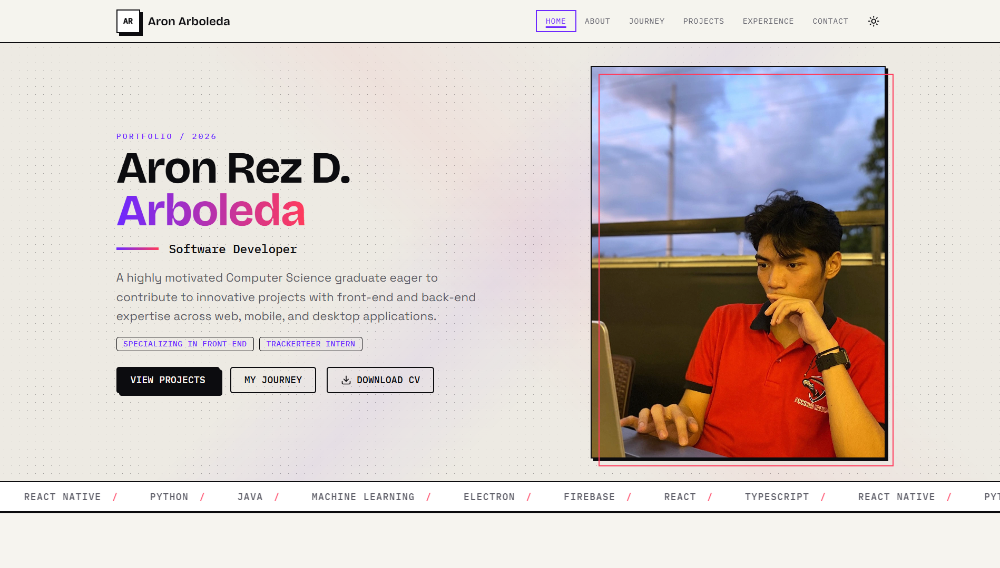
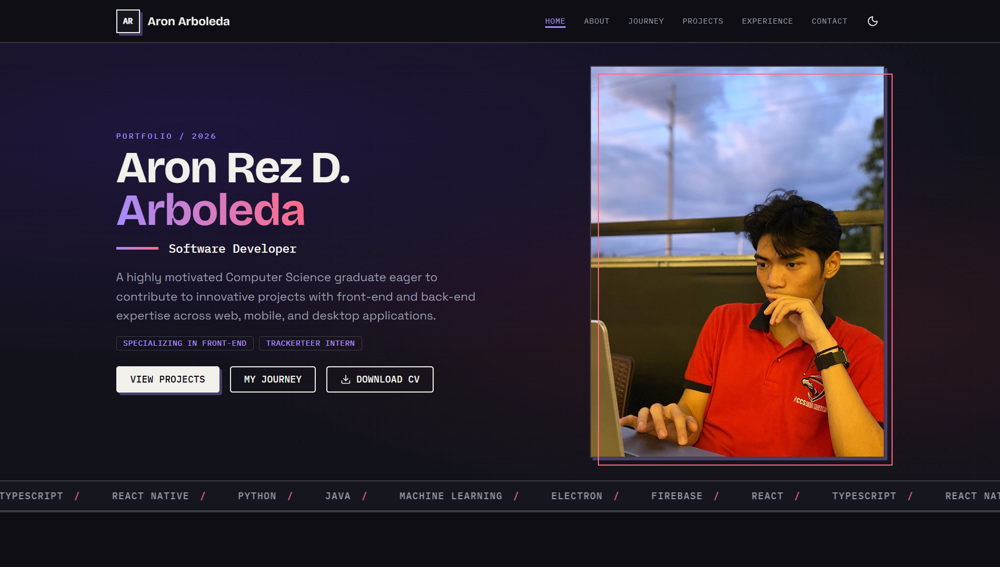
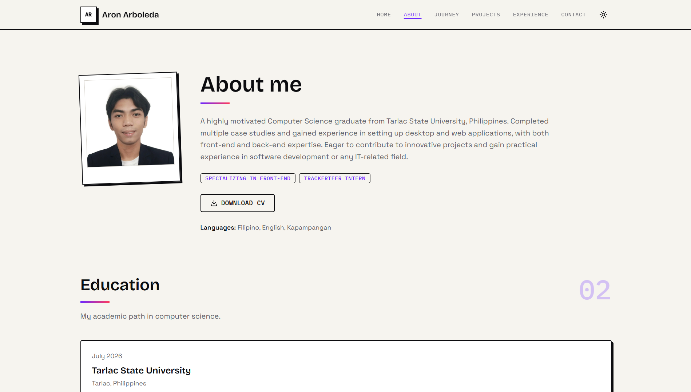
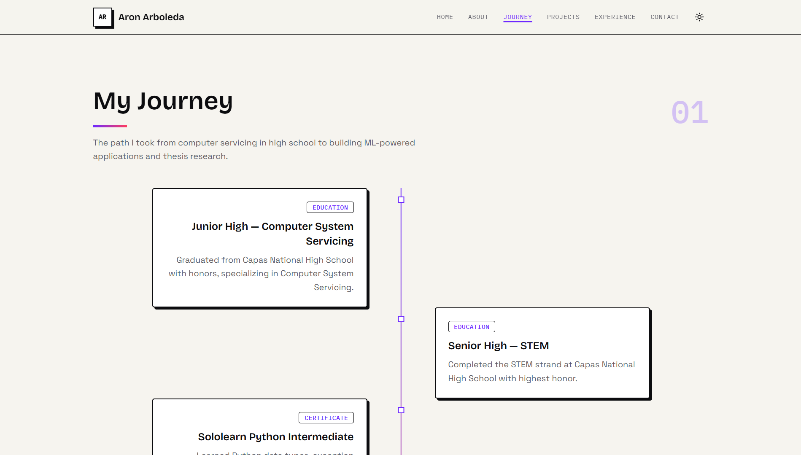
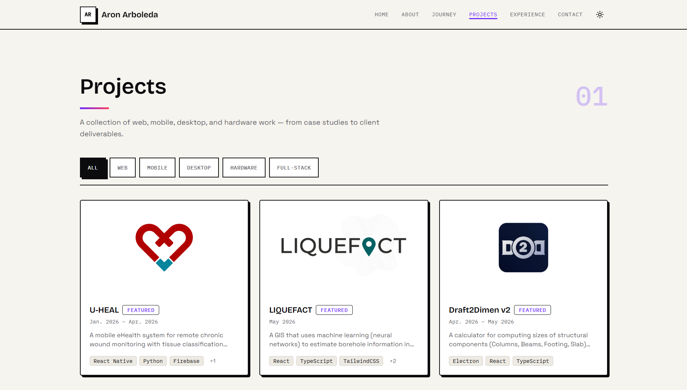
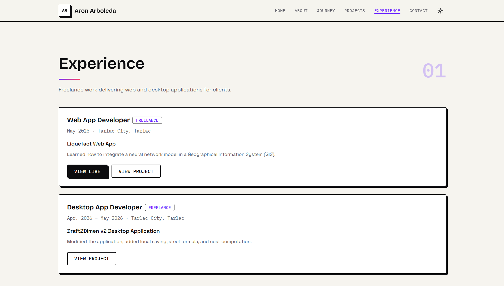
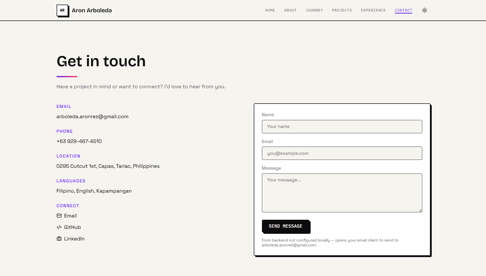

# Aron Arboleda — Portfolio

Personal portfolio of **Aron Rez D. Arboleda**, a Computer Science graduate and software developer from Tarlac, Philippines. The site showcases thesis work, freelance deliverables, case studies, and professional experience across **web, mobile, desktop, and hardware** projects.

**Design:** Ink & Voltage — a light-first, editorial layout with hard borders, offset shadows, violet and coral accents, and Bricolage Grotesque + Space Grotesk typography.

---

## Preview

### Home

| Light mode | Dark mode |
| ---------- | --------- |
|  |  |

Hero with portrait, skill marquee, featured project bento grid, interactive tech-stack badges, and build-area cards.

### About



Bio, education timeline, clickable certificate gallery (lightbox viewer), organization cards with external links, resume download, and profile highlights.

### Journey



Chronological milestones from junior high through graduation — education, certificates, projects, organizations, and career moments in a zigzag timeline.

### Projects



Filterable project catalog with category tabs (Web, Mobile, Desktop, Hardware, Full-stack). Each project has a dedicated detail page with overview, tech stack, gallery, challenges, and learnings.

### Experience



Freelance gigs and internship history with deliverables, dates, and links to live demos or related project pages.

### Contact



Contact form (Web3Forms), email, phone, and social links.

---

## Site map

| Route | Page | What's there |
| ----- | ---- | ------------ |
| `/` | **Home** | Hero, featured projects, tech stack, build areas, CTAs to projects and contact |
| `/about` | **About** | Objective, education, certificates, organizations, resume |
| `/journey` | **Journey** | Life and career timeline |
| `/projects` | **Projects** | All projects with filters |
| `/projects/:slug` | **Project detail** | Full case study per project |
| `/experience` | **Experience** | Work history |
| `/contact` | **Contact** | Get in touch |

---

## Featured projects

Highlighted on the home page and marked as featured in the catalog:

| Project | Type | Summary |
| ------- | ---- | ------- |
| [U-HEAL](src/data/projects/u-heal.ts) | Mobile + Web | Bachelor's thesis — eHealth system for chronic wound monitoring with U-Net tissue classification |
| [Liquefact](src/data/projects/liquefact.ts) | Web | GIS with machine learning for borehole prediction in Tarlac |
| [Draft2Dimen v2](src/data/projects/draft2dimen-v2.ts) | Desktop | Structural component calculator with rebar, steel formula, and cost computation |
| [Liwanag at Dunong](src/data/projects/liwanag-at-dunong.ts) | Full-stack Web | NGO volunteer platform with admin dashboard |

---

## All projects

| Project | Categories | Role |
| ------- | ---------- | ---- |
| U-HEAL | Mobile, Web | Thesis — full-stack developer |
| Liquefact | Web | Freelance — GIS + neural network integration |
| Draft2Dimen v2 | Desktop | Freelance — feature expansion |
| Gas & Smoke Detector | Hardware | Electronics — Arduino case study |
| Draft2Dimen | Desktop | Freelance — client + UI/UX collaboration |
| Liwanag at Dunong | Full-stack | NGO web developer |
| Rebyu | Full-stack | Gamified flashcard web app |
| ASEAN Library Database | Desktop | MS Access RDBMS case study for ASEAN cultural materials |
| SPELL | Desktop | Grammar-checking desktop app |
| Subnetting & VLSM Calculator | Web | Browser-based networking calculators |
| Zodiac Sign Identifier | Web | Static zodiac lookup by birth date |
| Pivit | CLI | Gamified Python to-do list with quests and shop |
| Nom Veterinary Clinic | Desktop | VB.NET case study |
| Reminders Builder | Desktop | Java Swing case study |

---

## Work experience

| Role | Type | Period | Deliverable |
| ---- | ---- | ------ | ----------- |
| Web App Developer | Freelance | May 2026 | [Liquefact Web App](https://liquefact-web.vercel.app/) |
| Desktop App Developer | Freelance | Apr. – May 2026 | Draft2Dimen v2 |
| Project Assistant | Internship (OJT) | June – July 2025 | Inventeer Web App @ Trackerteer |
| Desktop App Developer | Freelance | Mar. – May 2025 | Draft2Dimen |

---

## About page content

- **Education** — BS Computer Science (Magna Cum Laude), Tarlac State University; STEM senior high; Computer System Servicing junior high
- **Certificates** — RAITE Hackathon, Cisco CCNA (×2), Sololearn JavaScript & Python — each viewable as a scan in a lightbox
- **Organizations** — [Liwanag at Dunong](https://liwanagatdunongproject.ct.ws/) (volunteer & web dev), Programmers' Den @ TSU
- **Languages** — Filipino, English, Kapampangan

---

## Tech stack (site)

React 19 · TypeScript · Vite · Tailwind CSS v4 · React Router · Framer Motion · Vercel Analytics · Web3Forms

---

## Content source

All copy and structured data live in `src/data/` (`profile.ts`, `projects/`, `experience.ts`, `education.ts`, `certificates.ts`, `organizations.ts`, `journey.ts`, `skills.ts`). Images go in `public/images/`.

To edit narratives, reflections, or assets, see [CONTENT.md](CONTENT.md) and [public/images/README.md](public/images/README.md).

```bash
npm install && npm run dev   # http://localhost:5173
```
